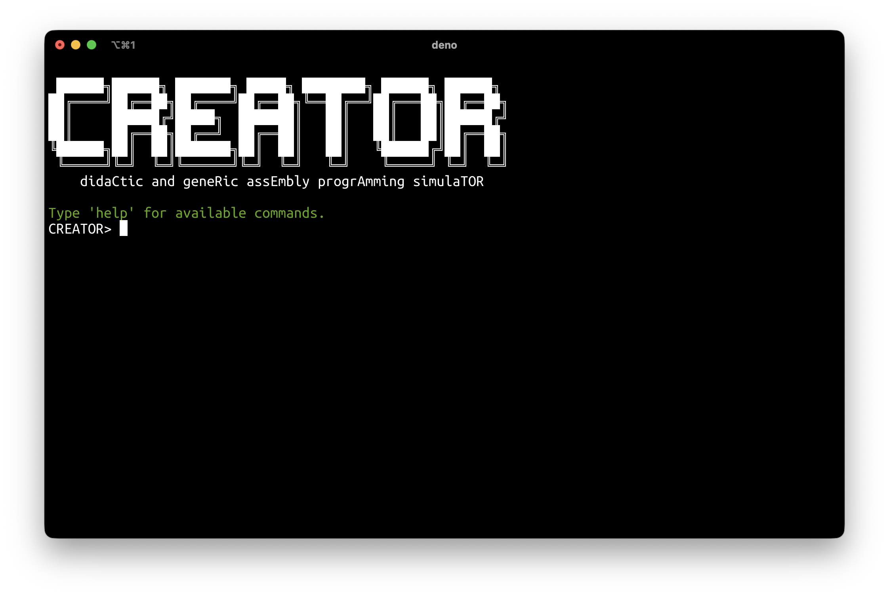

# CLI User Guide

The CREATOR Command-Line Interface (CLI) provides a powerful text-based environment for assembly programming, debugging, and testing. It's designed for users who prefer working in a terminal and offers advanced features for development and automation.

*Figure: CREATOR CLI interactive prompt.*

## Overview

The CLI version offers several advantages over the web version:

### Key Features

- **Interactive Mode**: Full-featured REPL with command history
- **State Management**: Save and restore complete simulator snapshots
- **Configuration System**: Customize aliases, shortcuts, and preferences via YAML
- **Accessible Mode**: Screen reader support for visually impaired users

## Next Steps

- Start with [Installation](installation.md) to get the CLI up and running.