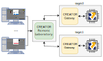

# Setting up the Remote Laboratory

The remote laboratory allows users to remotely execute their programs on real hardware through the use of multiple [CREATOR Gateways](../web/gateway.md).

> [!IMPORTANT]
> Currently, only the [ESP32 Gateway](../web/gateway.md#executing-the-esp32-gateway) is supported.



_Figure: CREATOR Remote Laboratory_


## Setup and configuration
The recommended way of running the remote laboratory is through the [Docker image](https://hub.docker.com/r/creatorsim/creator-remote-lab).

> [!TIP]
> For alternative ways of execution, check the [source repository](https://github.com/creatorsim/creator-remote-lab).

First, create a file structure such as this:
```
creator-remote-lab/
├─ compose.yaml
├─ results/
├─ config/
│  ├─ deployment.json
```

On the remote lab container configuration:
- `results/` must be mounted to `/app/results/` and `config/` to `/app/config/`
- The server will listen on port `5000`, so we should expose that port
- In order to send the results via email, you must set your Google Mail address in the `EMAIL` environment variable and your [app pasword](https://support.google.com/mail/answer/185833?hl=en) in the `PASSW` environment variable.

We should also deploy the gateways. More information on [CREATOR Gateway](../web/gateway.md).


We can do all this with Docker Compose, in the `compose.yaml` file:
```yaml
services:
  creator-remote-lab:
    image: creatorsim/creator-remote-lab:latest
    volumes:
      - ./config:/app/config
      - ./results:/app/results
    ports:
      - "5000:5000"
    environment:
      - EMAIL=test@inf.uc3m.es  # google mail address
      - PASSW=abcdefghijklmnop  # google app password

  target-0:
    image: creatorsim/creator-gateway-esp32:latest
    devices:
      - /dev/ttyUSB0
    stdin_open: true
    tty: true

  target-1:
    image: creatorsim/creator-gateway-esp32:latest
    devices:
      - /dev/ttyUSB1
    stdin_open: true
    tty: true
```

The configuration of the target boards is placed in `config/deployment.json`. You must provide the type of board (`target_board`), the USB port of the board (`target_port`), and the URL of the gateway server (`target_url`). As we're doing everything with Docker Compose, we can just use their container names and prevent exposing the ports to `localhost`.

E.g.:
```json
{
  "target-0": {
    "target_board": "esp32c3",
    "target_port": "/dev/ttyUSB0",
    "target_url": "http://target-0:8080"
  },
  "target-1": {
    "target_board": "esp32c3",
    "target_port": "/dev/ttyUSB1",
    "target_url": "http://target-1:8080"
  }
}
```

The execution results will be stored in the `results/` folder.


Then, we can deploy everything with:
```
docker compose up
```
