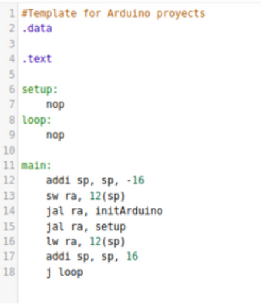
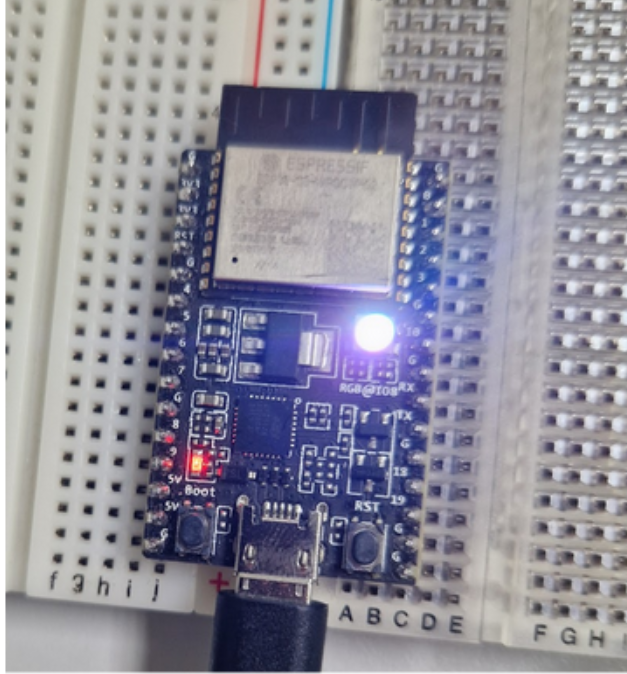
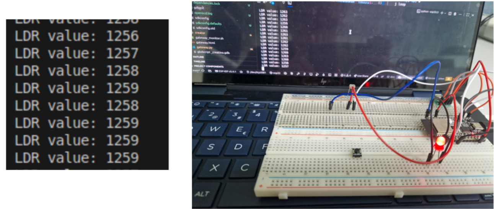
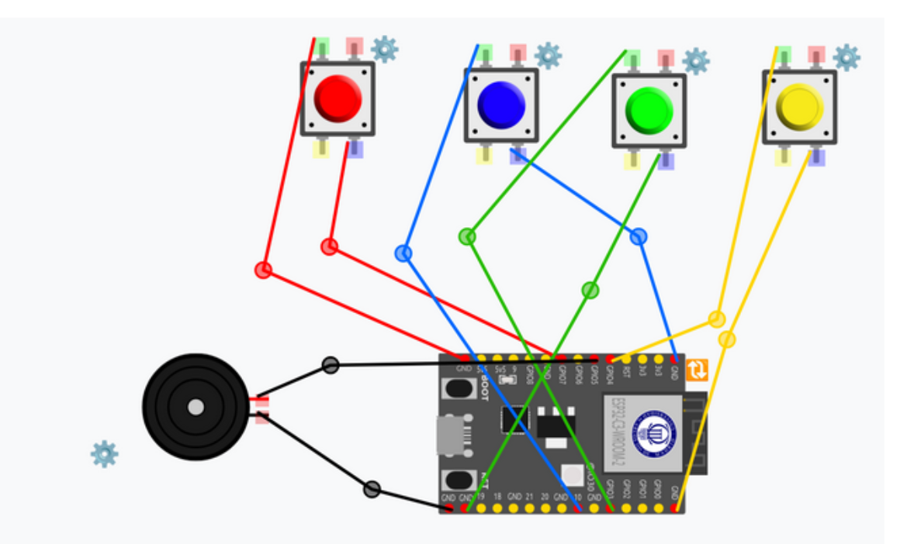
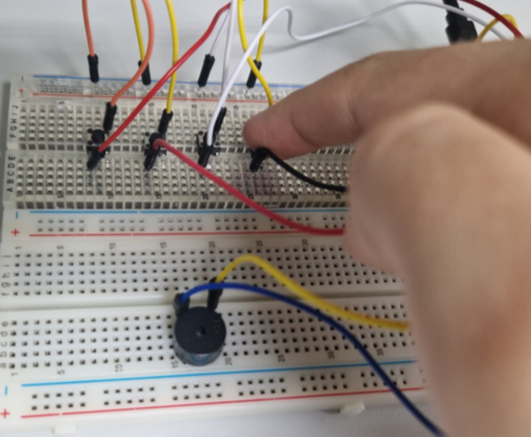

# Arduino CREATOR module

This new library is only for Espressif 32-bits boards added in CREATOR. Checkout ESP32 gateway setup information.

## How to start using CREATino library functions

CREATOR lets the user add their custom libraries using Library button. This update gives already a shortcut to add Arduino library inside CREATOR in "Load Arduino Library" option. This functiongs will be displayed on the right.


Except printf function (excusively for Espressif Arduino devices) all the functions displayed can be founded in Arduino Original's [Documentation](https://docs.arduino.cc/language-reference/#functions) and in CREATOR's Info button "Creatino Help".

### Create your first program

As in the original arduino sketches, CREATino programs must have an structure composed by a "setup" and a "loop" function. To help this issue, users can load a template in Example's called "“*Example 1: Template for new examples*" ready to use.



### Integrate Arduino Library in Target Flash menu

Once your program is done and compiled, in Target Flash menu is necesary to activate "Arduino Support" checkbox below *Select Target Board* option.


### Aspects to consider using this library

1. The ESP32 boards suppoirted do not have float pòinter support. Arduino functions with float or double outputs will fail.
2. Avoid using this GPIO numbers:
   1. **GPIO8:** BOOT MODE pin. It might show up this error code:

      ```
      Serial port /dev/ttyUSB0
      Connecting......................................

      A fatal error occurred: Failed to connect to ESP32-C3: Wrong boot mode detected (0x0)! The chip needs to be in download mode.
      For troubleshooting steps visit: https://docs.espressif.com/projects/esptool/en/latest/troubleshooting.html

      ```
   2. **GPIO 18 and 19:** Debug pins

## Use cases

### Use case 1: Internal LED Blink

This example is used to check if GPIO functions work correctly inside a ESP32 board.

* **Components:** ESP32-C3-DevKitC-02 board
* **Steps**:
  1. **Setup**: Establish Internal LED as an output.

In ESP32-C3-DevKitC-02, internal LED pin corresponds to pin 30 and as it's a LED, it must be tagged as output. We use **pinMode** function for this.
Which values can pinMode have? Depending on the proyect necessities, pinMode can have this values:

| Mode                      | Value | Usage                                                                                                                              |
| ------------------------- | ----- | ---------------------------------------------------------------------------------------------------------------------------------- |
| INPUT                     | 0x01  | Digital input mode                                                                                                                 |
| OUTPUT                    | 0x03  | Digital output mode                                                                                                                |
| PULLUP                    | 0x04  | Enables the internal pull-up resistor on an input pin (if the pin is disconnected, it will read HIGH). Buttons connected to ground |
| INPUT_PULLUP              | 0x05  | Combines input configuration (0x01) with pull-up (0x04)                                                                            |
| PULLDOWN                  | 0x08  | Ensures the pin reads LOW when disconnected                                                                                        |
| INPUT_PULLDOWN            | 0x09  | Ensures the pin reads LOW when disconnected                                                                                        |
| OPEN_DRAIN (Data buses)   | 0x10  | Output can only pull to ground; reading HIGH requires an external resistor or pull-up                                              |
| OUTPUT_OPEN_DRAIN (Buses) | 0x13  | Combines digital output with open-drain mode                                                                                       |
| ANALOG                    | 0xC0  | Configures the pin for analog input (ADC)                                                                                          |

In this case, setup function will look like this:

```
setup:
    #pinMode(LED_BUILTIN, OUTPUT);
    li a0,30
    li a1,  0x03
    addi sp, sp, -4   
    sw ra, 0(sp)  
    jal ra, pinMode
    lw ra, 0(sp)  
    addi sp, sp, 4
    jr ra
```

2. **Loop**: Turn the LED on and off.

  The LED has been set up; now it is necessary to turn it on and off, creating a blinking effect. For this, the **digitalWrite** function will be used.
  This function needs the number of the pin used (pin 30) and the state to write (in this case 0x1 or HIGH to turn on the light and 0x0 to turn it off)

  On the other hand, we will use delay function to generate a retard between change of state of the LED. This function only need the delay time on miliseconds. For this example, this quantityof time will be stored in memory.

This is the result

```
.data
  time:
     .word 1000 
.text
loop:
    #digitalWrite(LED_BUILTIN, HIGH);
    li a0,30 
    li a1, 0x1
    addi sp, sp, -4   
    sw ra, 0(sp)
    jal ra, digitalWrite
    lw ra, 0(sp)  
    addi sp, sp, 4
    #delay(1000);
    la a0, time
    lw a0, 0(a0)
        addi sp, sp, -4  
    sw ra, 0(sp)
    jal ra, delay
    lw ra, 0(sp)  
    addi sp, sp, 4 
    #digitalWrite(LED_BUILTIN, LOW);
    li a0,30 
    li a1, 0x0
    addi sp, sp, -4   
    sw ra, 0(sp)
    jal ra, digitalWrite
    lw ra, 0(sp)  
    addi sp, sp, 4 
    #delay(1000);
    la a0, time
    lw a0, 0(a0)
    addi sp, sp, -4  
    sw ra, 0(sp)
    jal ra, delay
    lw ra, 0(sp)  
    addi sp, sp, 4 
    j loop

```

Now the LED will start blinking.



## Use case 2: Button + LED

This Use Case will be overriden using interruptions and the recursive way.

* **Components:**
  * ESP32-C3-DevKitC-02 board
  * Button (in GPIO 6)
  * LED (in GPIO 4)


### Recursive way

* **Steps**:

  1. **Setup**: Establish Internal LED as an output and button as input.
     As shown in Use Case 1, you need to configure the pin mode with **pinMode** before using the pins.

     1. **LED:** GPIO 4 as OUTPUT
     2. **Button:** GPIO 6 as INPUT

     This is the result:

     ```
     .data
        buttonPin: .word  6
        ledpin: .word 4
     .text
     setup:
     #pinMode(buttonPin,INPUT_PULLUP)
     la a0, buttonPin
     lw a0, 0(a0)
     li a1,  0x05 #INPUT_PULLUP
     addi sp, sp, -4
     sw ra, 0(sp)
     jal ra, pinMode
     lw ra, 0(sp)
     addi sp, sp, 4

     #pinMode(ledpin,OUTPUT)
     la a0, ledpin
     lw a0, 0(a0)
     li a1,  0x03 #OUTPUT
     addi sp, sp, -4
     sw ra, 0(sp)
     jal ra, pinMode
     lw ra, 0(sp)
     addi sp, sp, 4

     jr ra
     ```
  2. **Loop**: Read button state.
     Once set up, we start the infinite loop by reading the button state using **`digitalRead`**, to which we only need to pass the button’s pin (in this case, pin 6).

  In our case, if it detects that the button is pressed, the `button_pressed` function will be called. Otherwise, the LED will remain off.

  A small `delay` is added to avoid overloading the system.

  ```
  .data
  time:  .word 100
  .text
  loop:
  la a0, buttonPin
  lw a0, 0(a0)
  addi sp, sp, -4
  sw ra, 0(sp)
  jal ra, digitalRead
  lw ra, 0(sp)
  addi sp, sp, 4

  mv t0,a0

  li t1 ,0 #LOW

  beq t0,t1,button_pressed

  la a0, ledpin
  lw a0, 0(a0)
  li a1, 0x0
  jal ra, digitalWrite

  la a0, time
  lw a0, 0(a0)
  addi sp, sp, -4
  sw ra, 0(sp)
  jal ra, delay
  lw ra, 0(sp)
  addi sp, sp, 4

  j loop

  ```

  3. **Button_pressed**: Action when the button is pressed.
     As shown in Use Case 1, we will turn on the LED when button is pressed, as shown below:

  ```
  button_pressed:  
    la a0, ledpin
    lw a0, 0(a0)
    li a1, 0x1
    addi sp, sp, -4  
    sw ra, 0(sp)
    jal ra, digitalWrite
    lw ra, 0(sp)  
    addi sp, 4 

    la a0, time
    lw a0, 0(a0)
    addi sp, sp, -4  
    sw ra, 0(sp)
    jal ra, delay
    lw ra, 0(sp)
    addi sp, 4 

    jr ra
  ```

### Using interruptions

Another way to achieve this project is by using GPIO interrupts, which are much more immediate but more complex to program.

In this case, we will use the Arduino functions `attachInterrupt()` and `digitalPinToInterrupt()` to obtain the interrupt number that can be assigned to the interrupt service routine for that pin.

1. **Setup**: Establish Internal LED as an output and button as input.
   As shown in Use Case 1, you need to configure the pin mode with **pinMode** before using the pins.

   Then we connect the button pin to an interrupt routine or ISR (which we will call `blink`) that runs automatically when the button is pressed. For this we will use `attachInterrupt `function.

   The attachInterrupt function takes the following parameters:

   * The interrupt position corresponding to the pin for which we want to detect the interrupt (we use digitalPinToInterrupt(pin))
   * The memory address where the interrupt service routine is located (in this case, we call it blink)
   * The interrupt mode, that can be one of the following:

| Mode      | Value | Usage                                                                                                             |
| --------- | ----- | ----------------------------------------------------------------------------------------------------------------- |
| DISABLED  | 0x00  | Interrupt disabled                                                                                                |
| RISING    | 0x01  | Interrupt triggered on the rising edge (when the pin changes from LOW to HIGH)                                    |
| FALLING   | 0x02  | Interrupt triggered on the falling edge (when the pin changes from HIGH to LOW)                                   |
| CHANGE    | 0x03  | Interrupt triggered on any change of the pin state (both LOW→HIGH and HIGH→LOW)                                 |
| ONLOW     | 0x04  | Interrupt triggered while the pin remains LOW                                                                     |
| ONHIGH    | 0x05  | Interrupt triggered while the pin remains HIGH                                                                    |
| ONLOW_WE  | 0x06  | Same as ONLOW, but with write enable — allows modifications or writing to related registers while the pin is LOW |
| ONHIGH_WE | 0x07  | Same as ONHIGH, but with write enable                                                                             |

In this case, as we want the interruption when the button is pressed, we choose ON_LOW mode.

This is how the setup will look

```
.data
    ledPin: .byte 4
    interruptpin: .byte 6
    state: .byte 0 #LOW
    on_low: .byte 0x04
.text
setup:
    #Start pins
    la t1, ledPin
    lb a0, 0(t1) 
    li a1, 0x03 #OUTPUT
    addi sp, sp, -4
    sw ra,0(sp)
    jal ra, pinMode #pinMode(ledPin, OUTPUT);
    lw ra,0(sp)
    addi sp, sp, 4
    la t1, interruptpin
    lb a0, 0(t1) 
    li a1, 0x05  #INPUT_PULLUP
    addi sp, sp, -4
    sw ra,0(sp)
    jal ra, pinMode# pinMode(ledPin, INPUT_PULLUP);
    lw ra,0(sp)
    addi sp, sp, 4
    la t1, interruptpin
    lb a0, 0(t1) 
    addi sp, sp, -4
    sw ra,0(sp)
    jal ra, digitalPinToInterrupt #digitalPinToInterrupt(interruptpin);
    lw ra,0(sp)
    addi sp, sp, 4
  
    la a1, blink

    la t1, on_low
    lb a2, 0(t1)
  
    addi sp, sp, -4
    sw ra,0(sp)
    jal ra, attachInterrupt #attachInterrupt(digitalPinToInterrupt(interruptPin), blink, ON_LOW);
    lw ra,0(sp)
    addi sp, sp, 4
    jr ra


```

2. **Blink**: ISR definition.
   What do we want to happen when the interrupt is detected? (In this case, when the button state changes.)

Well, in this case, we want the LED state to be changed.

Specifically, we will modify a variable stored in memory that indicates the LED’s state, as follows:

```
blink:
    addi sp, sp, -8   
    sw ra, 4(sp)  
    sw t0, 0(sp)  

    la t0, state  
    lb a0, 0(t0)  
    xori a0, a0, 1      #  0->1, 1->0
    sb a0, 0(t0) 
    lw t0, 0(sp)  
    lw ra, 4(sp)  
    addi sp, sp, 8  
    jr ra  
```

3. **Loop**: Change LED state.

LED will be turned off until the button is pressed, as shown in the following code:

```
loop:
    la t1, ledPin
    lb a0, 0(t1)
    li a1,0
    addi sp, sp, -4
    sw ra,0(sp)
    jal ra, digitalWrite# digitalWrite(ledPin, state)
    lw ra,0(sp)
    addi sp, sp, 4
  
    li a0, 100
    addi sp, sp, -4
    sw ra,0(sp)
    jal ra, delay # delay(100)
    lw ra,0(sp)
    addi sp, sp, 4
    j loop

setup:
    #Start pins
    la t1, ledPin
    lb a0, 0(t1) 
    li a1, 0x03 #OUTPUT
    addi sp, sp, -4
    sw ra,0(sp)
    jal ra, pinMode #pinMode(ledPin, OUTPUT);
    lw ra,0(sp)
    addi sp, sp, 4
    la t1, interruptpin
    lb a0, 0(t1) 
    li a1, 0x05  #INPUT_PULLUP
    addi sp, sp, -4
    sw ra,0(sp)
    jal ra, pinMode# pinMode(ledPin, INPUT_PULLUP);
    lw ra,0(sp)
    addi sp, sp, 4
    la t1, interruptpin
    lb a0, 0(t1) 
    addi sp, sp, -4
    sw ra,0(sp)
    jal ra, digitalPinToInterrupt #digitalPinToInterrupt(interruptpin);
    lw ra,0(sp)
    addi sp, sp, 4
  
    la a1, blink

    la t1, change
    lb a2, 0(t1)
  
    addi sp, sp, -4
    sw ra,0(sp)
    jal ra, attachInterrupt #attachInterrupt(digitalPinToInterrupt(interruptPin), blink, CHANGE);
    lw ra,0(sp)
    addi sp, sp, 4
    jr ra

```

This is the result: In both cases, will be having a LED turning on when the button is pressed.


## Use case 3: Text input/output using serial output.

For this use case, we are going to make a little use of basic functions from the Arduino Serial library. For more information, here is the [official documentation](https://docs.arduino.cc/language-reference/en/functions/communication/serial/) (not all functions are available in this library, as they are not the most suitable for the environment in which we are working).

⚠ By definition, serial input functions are very fast (they do not wait for you to press Enter) and do not display a callback of what has been written. The purpose of this library is to familiarize yourself with these functions; therefore, **it is the student's responsibility to monitor each step** of what is being done.

Just as we previously used the `ecall` instruction to print messages in assembly CREATOR programs, here we will use the `serial_printf`function, which is part of Espressif's Arduino component.

Unlike higher-level functions like Serial.print and Serial.println,`serial_printf`requires explicit format specifiers to indicate the data types being printed; otherwise, the output is interpreted as a string.

On the other hand, we will use the `serial_readBytes`function to see how text input works. There is the `serial_read `variant (which only takes 1 character), `serial_readBytesUntil `(which stops storing characters when it finds the specified character), and those that parse, such as serial_parseInt (which only takes numbers).

* **Components:** ESP32-C3-DevKitC-02 board

  * **Steps**:

    1. **Data**: Save messages to print in memory.
       For this use case we are going to declare in data section:
        -  The initial message to be displayed.
        -  The buffer allocated to store the input text.
        -  The message that includes a placeholder for outputting the entered text.
        -  An auxiliary callback used to display the entered number.

       This would be reflected in the code as follows:

      ```
        .data
            space:   .zero 100 #Buffer to place the string
            initial: .string "Introduce number of letters:\n"
            aux: .string "%d\nType your message\n"
            print:  .string "Your message: %s\n"

      ```

    2. **Serial**: Start terminal output and input.

       On most boards, such as Arduino and Espressif, in order to use the terminal, it needs to be initialized with a specific frequency. In this case, we will use the serial_begin function with a baud rate of 115200.

       If a value other than the one given is entered, strange characters may be printed or nothing may be printed at all.

       It is declared in the code as follows:

       ```
        setup:
            li a0,115200 
            addi sp, sp, -4  
            sw ra, 0(sp)   
            jal ra, serial_begin
            lw ra, 0(sp)   
            addi sp, sp,4
            jr ra

      ```

    3. **Loop**: Check if the terminal is correctly open.
       A good practice that can be seen in Arduino is to use serial_available to see if the terminal has opened correctly.

    If it has a value greater than 0, it means that it is operational and ready to use.

    ⚠ ️ For simplicity's sake, you will often find that this check is not performed... but using serial_available is a very good error control.

    So, we start our loop as follows:

    ```
    loop:
        addi sp, sp, -4   
        sw ra, 0(sp)  
        jal ra, serial_available
        lw ra, 0(sp)  
        addi sp, sp, 4
        beqz a0,aux_print
        j loop  

    ```

    * aux_print is an auxiliary function to indicate to the user that they should enter the number only once. This is purely aesthetic but can provide clarity to the user.

    ```
    aux_print:
        #serialPrintf 
        la a0,initial
        addi sp, sp, -4   
        sw ra, 0(sp)  
        jal ra, serial_printf
        lw ra, 0(sp)  
        addi sp, 4
        j read_num

    ```

    * `read_num`:read a number from terminal

    In this case, we use the `serial_parseInt `function to get a number per terminal.

    ⚠ Why don't we use `serial_read`? Because `serial_read`, although it returns a number, interprets the input in ASCII code. ️

    * If we enter the number “4” via the terminal, the values change:
      - In `serial_read`: 52
      - In ` serial_parseInt`: 4

    Since `serial_read` is very fast, we will not move on to the next step if there is no number greater than 0 collected in a0, leaving the following code snippet:

    ```
    read_num:
       addi sp, sp, -4
       sw ra, 0(sp)
       jal ra, serial_parseInt
       lw ra, 0(sp)
       addi sp, sp,4mv t0, a0
       bnez t0, print_int
       j read_num
    ```

    A small auxiliary function called `print_int` was created to view the callback of the value specified as length, as follows.

    ```
    print_int:
      la a0, aux
      mv a1,t0
      addi sp, sp, -4sw ra, 0(sp)jal ra, serial_printf
      lw ra, 0(sp)
      addi sp, 4
      j read_function 
    ```

    * `read_function`: Read the text of the requested length
      Once we have the length of our string, we collect the text we want to add with seria_readBytes, which is blocking until the requested length of characters has been reached.

    We would end up with an implementation like this:

    ```
    read_function:
       la a0, space
       mv a1, t0 # number of letters it will have
       addi sp, sp, -4
       sw ra, 0(sp)
       jal ra, serial_readBytes
       lw ra, 0(sp)
       addi sp, sp, 4bne t0,a0,read_functionla a0, print
       la a1, space
       addi sp, sp, -4
       sw ra, 0(sp)
       jal ra, serial_printf
       lw ra, 0(sp)
       addi sp, 4
       jr ra
    ```

    And this is the result!

    

## Use case 4: Daytime running lights with analogRead.

This time, we are going to make a small LED that lights up when it detects low light, using an LDR.

 ⚠  The sensitivity values of the sensor may vary depending on the location of the student and their device. We recommend having a flashlight or something that gives off light handy and using the debugger or prints.

**Components:**: this proyect cannot be replicated in graphic environment at the moment

* ESP32-C3-DevKitC-02 board
* LDR or photorresistence (in GPIO 2)
* LED (in GPIO 4)
* 10kΩ resistence

  

To find resistors with the correct value, look at the color code on their bands. You can either look at the color guide, use this [calculator](https://www.mouser.es/technical-resources/conversion-calculators/resistor-color-code-calculator), or simply look for a resistor that matches the one in the photo.


* **Steps**:

  1. **Setup**: Initialize LDR, pin, and serial output.
     To use the sensor, we must initialize it with `pinMode` to the value of INPUT (0x01) as we saw in Figure 2.1.
     The setup code would look like this:

     ```
     .data
         lightSensorPin: .word 2
         ledPin: .word 4
         time: .word 100
         aux_msg: .string "LDR value: %d\n"

     .text
     setup:
     #Serial
         li a0,115200 
         addi sp, sp, -4  
         sw ra, 0(sp)   
         jal ra, serial_begin
         lw ra, 0(sp)   
         addi sp, sp,4
     # PinMode LED 
         la t1, ledPin
         lw a0, 0(t1) 
         li a1, 0x03 #OUTPUT
         addi sp, sp, -4
         sw ra,0(sp)
         jal ra, pinMode #pinMode(ledPin, OUTPUT);
         lw ra,0(sp)
         addi sp, sp, 4
     # Light sensor pin
         la t1, lightSensorPin
         lw a0, 0(t1) 
         li a1, 0x01
         addi sp, sp, -4
         sw ra,0(sp)
         jal ra, pinMode# pinMode(lightSensorPin, INPUT);
         lw ra,0(sp)
         addi sp, sp, 4

         jr ra

     ```

  2. **Loop**: Analog sensor reading
   Once everything is up and running, we read the light level in the room using `analogRead.`

In this tutorial, after a few tests, we found that the values reached were **between 1100 and 1400**. The darker it is, the higher the resistance value will be. **Therefore, a threshold of 1200 is set.**

* If the sensor reaches a value higher than 1200, the LED will turn on (`lightUp`).
* If, on the other hand, it does not reach that value, the LED remains off (`turnDown`).

In both cases, we add a small `delay `so that the readings are not so fast.

We finish with this code

```
    # delay
        la a0, time
    lw a0, 0(a0)
    addi sp, sp, -4  
    sw ra, 0(sp)
    jal ra, delay
    lw ra, 0(sp)  
    addi sp, sp, 4 
  
    j loop

loop:
#read LDR
    addi sp, sp, -4
    sw ra,0(sp)
    jal ra, analogRead #analogRead(lightSensorPin);
    lw ra,0(sp)
    addi sp, sp, 4
# Print value
    mv t1, a0
    mv a1,a0
    la a0,aux_msg
    addi sp, sp, -4   
    sw ra, 0(sp)  
    jal ra, serial_printf
    lw ra, 0(sp)  
    addi sp, sp, 4
  
# turn up led
    li t0, 1200 #Minumun value
    bgt t1, t0, lightUp
    blt t1, t0, turnDown
  
    j loop

```

And this is the result



## Use case 5: [Advanced] Piano using tone().

This case is a little more complex than the rest, but very creative. It is recommended to have a breadboard with plenty of space.

Each musical note is a frequency that blows air into the buzzer membrane. Consult [this page](https://www.tibotinspirationlab.com/reto/musica-con-arduino/) to learn how to calculate the other possible notes according to the desired tempo.

In this case, we are going to do it with interruptions. This example may cause a little more lag because there are continuous memory accesses and the “tone” function launches tasks.

Polling could be used.

* **Components:**: this proyect cannot be replicated in graphic environment at the moment
* ESP32-C3-DevKitC-02 board
* 4 buttons
* A passive buzzer



**Steps**:

1. **Data**: Declaration of pins and values of musical notes.
   We indicate in the data the pins we are going to use (avoiding “dangerous” pins such as GPIO8 and GPIO1) and the frequency values of the musical notes.

   Care must be taken with the position of these values, as we are going to use these      memory positions as arrays.

   In this example, we have positioned them as follows:

   ```
   .data
       # GPIO
       buzzerPin: .word 5
       button_C4: .word 7
       button_D4: .word 10
       button_E4: .word 3
       button_G4: .word 4

       # Notes
       note_C4: .word 262
       note_D4: .word 294
       note_E4: .word 330
       note_G4: .word 392
       #aux
       button_count: .word 4
       time_delay: .word 10
       anyPressed: .word -1 
       .align 4
       button_handlers:
           .word handleButton0
           .word handleButton1
           .word handleButton2
           .word handleButton3
   ```

   Another way to position them is like this:

   ```
   .data
       # GPIO
       buzzerPin: .word 5
       buttons: .word 7,10,3,4
       # Notes
       notes: .word  262,294,330,392
       #aux
       button_count: .word 4
       anyPressed: .byte -1
   .align 4
       button_handlers:
       .word handleButton0
       .word handleButton1
       .word handleButton2
       .word handleButton3
   ```
2. **Setup**: Configure all pins

   In this case, we are going to complicate things a little, as there are a lot of pins to configure.
   First, we will configure pin 5 of the buzzer, which, unlike the buttons, will use an OUTPUT mode (since it emits a sound to the outside).

   ```
   setup:
   #buzzer
       la a0, buzzerPin   
       lw a0, 0(a0)   
       li a1,  0x03 #OUTPUT
       addi sp, sp, -4  
       sw ra, 0(sp)   
       jal ra, pinMode
       lw ra, 0(sp)  
       addi sp, sp, 4
   ```

   Then, to configure the rest of the buttons, we created a loop that goes through all the selected buttons.

   First, in setup, after initializing the buzzer, we initialize the variables in our loop.

   ```
        la   s0, button_C4 #Button list
        li   s1, 0 # Position in the list
        la   t3, button_count
        lw   s2, 0(t3) #List length

   ```

   Next, we move on to the `loop_buttons` function, where we will:

   - Check if we have already gone through the entire list

   ```
   loop_buttons:
       bge  s1, s2, end_loop_buttons      # loop until all the buttons are positioned
   ```

   - If this is not the case, we scroll through the data to find the PIN number we want.

   ```
   # Take position of the button
   slli s3, s1, 2
   add  t1, s0, s3 #shift
   lw   s4, 0(t1) #Button value
   mv a0,s4
   ```

   - Once the position has been obtained, we configure the button with INPUT_PULLUP mode, as they are buttons.

   ```
   li a1,  0x05 #INPUT_PULLUP
   addi sp, sp, -4
   sw ra, 0(sp)
   jal ra, pinMode
   lw ra, 0(sp)
   addi sp, sp, 4
   ```

   - As we indicated in the statement, we are going to use interrupts, so we have to assign them now knowing which button we are on (that is, we take advantage of the fact that the order of `button_handlers` is the same as the order followed by the button array).

     For more information on how to assign interrupts, see case 2. We will indicate what the ISRs are like in the next point.

     ```
     #----Attach Interrupts
             #Transform digitalPin into interrupt
             mv a0, s4
             addi sp, sp, -4
             sw ra,0(sp)
             jal ra, digitalPinToInterrupt #digitalPinToInterrupt(interruptpin);
             lw ra,0(sp)
             addi sp, sp, 4
             # Search the correct pointer
             la t0, button_handlers
             add t1, t0, s3
             lw a1, 0(t1)
             # Let the interrupt jump when button is pressed (on_low)
             li a2, 0x03
             addi sp, sp, -4
             sw ra,0(sp)
             jal ra, attachInterrupt #attachInterrupt(digitalPinToInterrupt(buttonPin[i]), handler[i], ON_LOW);
             lw ra,0(sp)
             addi sp, sp, 4 
     ```
     - We add up a position and re-enter the loop

     ```
    addi s1, s1, 1                     # next button
    j    loop_buttons
    ```
    - If we have finished going through the list, we return to main by executing a ret (or a jr ra).

    ```
    end_loop_buttons:
        ret
    ```

3. **Loop**:

    This step can be done in two ways: with polling (i.e., constantly checking the status of all buttons) or with interrupts (pressing the button triggers an interrupt).

    The easiest way to do this exercise is to assign an interrupt to each button and, when pressed, have each one have its own ISR.

    Therefore, before starting the loop, we will create each of the necessary ISRs and assign them to the buttons. Refer to case 2 using interrupts for a better understanding.

    In this case, we use a “flag” change since the `tone()` function underneath launches ‘tasks’ or “processes” underneath, which is not safe to do in an ISR.

    ```
    #ISR
    handleButton0:
        la t0, anyPressed
        lw t1, 0(t0)
        li t2, 0 # Assign button
        sw t2, 0(t0)
        jr ra
    handleButton1:
        la t0, anyPressed
        lw t1, 0(t0)
        li t2, 1 # Assign button
        sw t2, 0(t0)
        jr ra
    handleButton2:
        la t0, anyPressed
        lw t1, 0(t0)
        li t2, 2 # Assign button
        sw t2, 0(t0)
        jr ra
    handleButton3:
        la t0, anyPressed
        lw t1, 0(t0)
        li t2, 3 # Assign button
        sw t2, 0(t0)
        jr ra  

    ```

    Then, inside the loop, we check the status of the `anyPressed` flag and add a small `delay` so that the watchdog does not trip.

    This loop checks that, if the flag is not at -1, the tone corresponding to that position sounds.
    ```
    loop:
        la t0, anyPressed   
        lw s0,0(t0)
        li t1, -1 
        bne s0, t1, startTune
        la t0, time_delay
        lw a0, 0(t0)
        addi sp, sp, -4
        sw ra,0(sp)
        jal ra, delay #delay(200); 
        lw ra,0(sp)
        addi sp, sp, 4
        j loop
   ```

4. `startTune`: start playing  the tone

In this case, once we have the position of the button that has been pressed, we search the memory array for the corresponding note value, similar to when we searched for the button.

To prevent the tone from having an indefinite duration, we have set a timeout of 200. Once the tone is played, it returns to the loop.

```
startTune:
    # Clean value
    la t0, anyPressed
    li t1, -1
    sw t1, 0(t0)
    #Search value
    la t0, note_C4
    slli s1, s0, 2 
    add t1,s1,t0   
    lw   s2, 0(t1) #Note value
    #Play Tone
    la t0, buzzerPin
    lw a0, 0(t0)
    mv a1,s2
    li a2, 200
    addi sp, sp, -4
    sw ra,0(sp)
    jal ra, tone #tone(buzzerPin, notes[i], duration);
    lw ra,0(sp)
    addi sp, sp, 4
    j loop 

```



And there we have our piano
