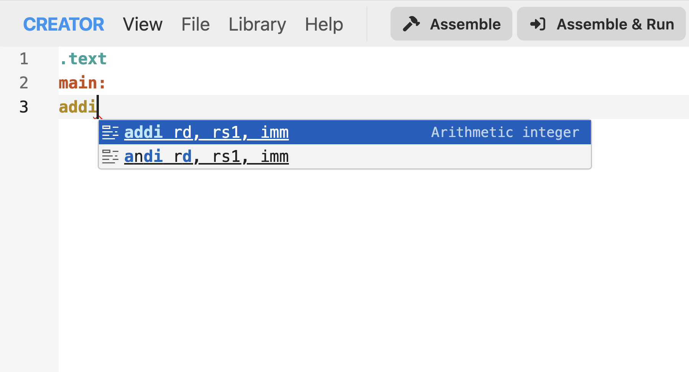
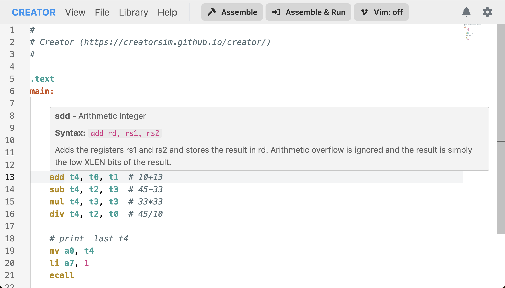

# Editor Features

The CREATOR web editor is based on Monaco Editor, the same editor that powers Visual Studio Code.

## Syntax Highlighting

Assembly language syntax is highlighted for better readability. This supports any architecture defined in CREATOR and requires no additional configuration.

Developers can extend or override the default syntax highlighting by creating their own language definitions. See the [Development](../development/editor.md) chapter for details.

## Auto-Completion (IntelliSense)

As you type, the editor suggests completions for instructions, registers, and labels. These suggestions adapt to the currently selected architecture.

*Figure: Auto-completion suggestions for RISC-V instructions.*

## Help Tooltips
Hover over instructions to see detailed help tooltips, including syntax, description, and usage examples.

*Figure: Help tooltip for the `ADD` instruction in RISC-V.*

## Go to Definition/References
Right-click a label and select "Go to Definition" to jump to its declaration. Right-click and select "Find All References" to see all usages of that label in your code.

*Figure: Finding all references to a label in the code.*

## Code Comments

### Single-Line Comments
Comments are architecture dependent. For RISC-V and MIPS, use `#` for single-line comments.
The comment prefix for any given architecture can be consulted in the [Architecture View](user-interface.md#architecture-view) chapter.

## Minimap

The minimap shows a bird's-eye view of your code:
- Located on the right side of the editor
- Shows entire file structure
- Click to jump to sections
- Highlights current viewport

## Error and Warning Indicators

In supported architectures, the editor provides real-time error and warning indicators as you type. These errors are displayed as squiggly lines under the relevant code sections.

Common errors include:
- Syntax errors
- Unknown instructions
- Invalid operands
- Missing labels

Hover over the squiggly lines to see detailed error messages.

*Figure: Error and warning indicators in the editor.*

## Vim Mode
Advanced users can enable Vim keybindings by clicking the "Vim" button in the editor toolbar. This activates Vim mode, allowing users to navigate and edit code using Vim commands. Custom keybinding can also be configured in the settings.

*Figure: Vim mode enabled in the editor.*
