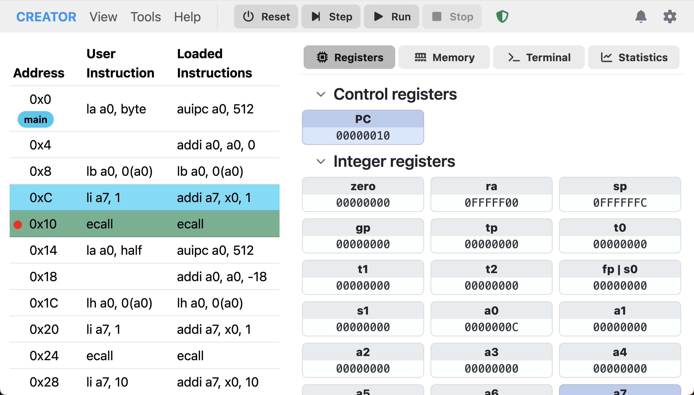

# Execution Control

The execution control panel allows you to run, step through, and reset your assembly programs. It provides essential controls for managing program execution within the simulator.

## Execution Controls
- **Run**: Starts or resumes program execution until a breakpoint is hit or the program ends.
- **Step**: Executes the next instruction.
- **Reset**: Stops execution and resets the program state to the beginning.
- **Pause**: Temporarily halts execution, allowing you to inspect the current state.

*Figure: Execution control buttons in the simulator panel.*

## Breakpoints
CREATOR supports breakpoints to help with debugging. To set a breakpoint, click on any instruction in the instruction list. A red dot will appear next to the instruction, indicating an active breakpoint. When the program execution reaches a breakpoint, it will pause, allowing you to inspect registers, memory, and other state information.

*Figure: Execution paused at a breakpoint.*

## Execution Modes
- **User Mode**: Standard execution mode with full access to user-level instructions.
- **Kernel Mode**: Elevated execution mode for system-level instructions (if supported by the architecture).

## Interrupt Handling
Some architectures support interrupts. In such cases, CREATOR reacts according to the architecture's interrupt handling mechanisms. RISC-V, MIPS, and Z80 have their own interrupt models that are simulated accordingly.