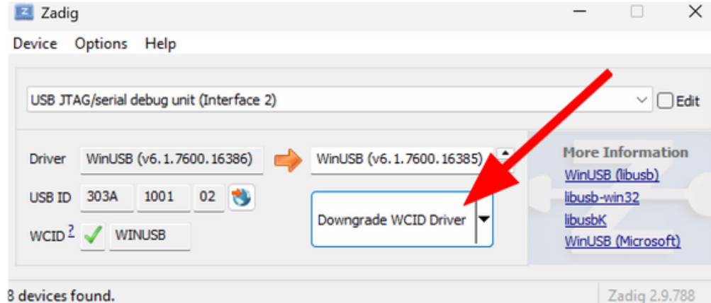
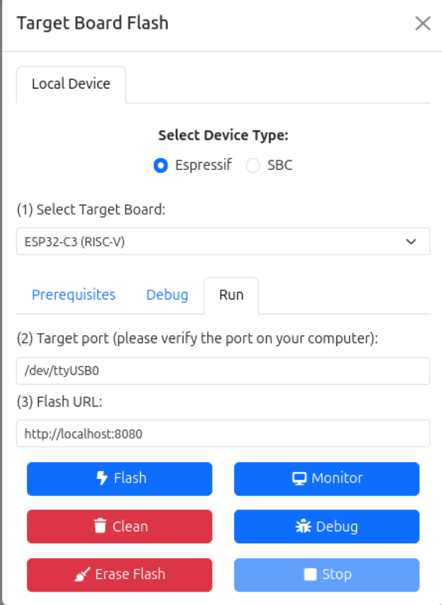

# CREATOR Gateway
CREATOR supports the execution of RISC-V programs in real hardware devices.


## Supported devices
CREATOR supports [Espressif ESP32](https://www.espressif.com/en/products/socs/esp32) development boards and RISC-V SBCs.


### Espressif ESP32
Espressif's family of ESP32 MCUs.

- [`esp32c3`](https://www.espressif.com/en/products/socs/esp32-c3)
  - [ESP32-C3-DevKitC-02](https://docs.espressif.com/projects/esp-dev-kits/en/latest/esp32c3/esp32-c3-devkitc-02/index.html) (includes JTAG)
  - [ESP32-C3-DevKitM-1](https://docs.espressif.com/projects/esp-dev-kits/en/latest/esp32c3/esp32-c3-devkitm-1/index.html) (no JTAG detected)
- [`esp32c6`](https://www.espressif.com/en/products/socs/esp32-c6)
  - [ESP32-C6-DevKitC-1](https://docs.espressif.com/projects/esp-dev-kits/en/latest/esp32c6/esp32-c6-devkitc-1/index.html) (JTAG + port included)
  - [ESP32-C6-DevKitM-1](https://docs.espressif.com/projects/esp-dev-kits/en/latest/esp32c6/esp32-c6-devkitm-1/index.html) (JTAG + port included)
- [`esp32h2`](https://www.espressif.com/en/products/socs/esp32-h2)
  - [ESP32-H2-DevKitM-1](https://docs.espressif.com/projects/esp-dev-kits/en/latest/esp32h2/esp32-h2-devkitm-1/user_guide.html) (JTAG + port)

These use the [creator-gateway-esp32](https://github.com/creatorsim/creator-gateway-esp32).


### Single-Board Computers
RISC-V SBC boards with Linux that can run SSH and [GDBGUI](https://www.gdbgui.com/). At the moment, SBC RISC-V boards with Ubuntu 24.04.3 for RISC-V fulfill these requirements.

- [OrangePi RV2](http://www.orangepi.org/html/hardWare/computerAndMicrocontrollers/service-and-support/Orange-Pi-RV2.html): 8 RISC-V cores, Wi-Fi and Bluetooth conection
- [Nezha D1-H 64 bit RISC-V](https://canonical-ubuntu-hardware-support.readthedocs-hosted.com/boards/how-to/allwinner-nezha-d1/): Single-core RISC-V64. It does not offer Wi-Fi conection or a GUI

These use the [creator-gateway-sbc](https://github.com/creatorsim/creator-gateway-sbc).


## Executing the ESP32 gateway

### Docker execution
This is the recommended way of executing the gateway on Windows, Linux, or macOS.

For more information, see the [IDF documentation](https://docs.espressif.com/projects/esp-idf/en/stable/esp32/api-guides/tools/idf-docker-image.html).


#### Windows
1. Install [Docker Desktop](https://docs.docker.com/desktop/install/windows-install/)
2. Connect your device and check which port it belongs to. You can do this with the `mode` terminal command, or in the Device Manager. The default port is `COM3`.
3. Setup the [Remote Serial Port](https://docs.espressif.com/projects/esp-idf/en/stable/esp32/api-guides/tools/idf-docker-image.html#using-remote-serial-port)
  1. Download and unzip [esptool](https://github.com/espressif/esptool/releases)
  2. Run `esp_ffc2217_server` in the device's port (e.g. `COM3`):
    ```powershell
    esp_rfc2217_server -v -p 4000 COM3
    ```
6. Run the container:
  ```bash
    docker run --init -it -p 8080:8080 -p 5000:5000 --name creator-gateway-esp32 creatorsim/creator-gateway-esp32
  ```

  > [!TIP]
  > You can also use a Docker compose file (`compose.yaml`):
  >
  > 1. Create the following `compose.yaml` file:
  >    ```yaml
  >    services:
  >      creator-gateway-esp32:
  >        image: creatorsim/creator-gateway-esp32:latest
  >        ports:
  >          - "8080:8080" # gateway
  >          - "5000:5000" # gdbgui
  >        stdin_open: true
  >        tty: true
  >        # for debug
  >        network_mode: bridge
  >        extra_hosts:
  >          - "host.docker.internal:host-gateway"
  >    ```
  > 2. Deploy the docker compose in the directory of the YAML file:
  >    ```bash
  >    docker compose up
  >    ```
  >
  > Take into account that `docker compose up` is not interactive, therefore the program won't be able to read the inputs. You can run `docker compose up -d` and then attach to the specific container (check its name/id with `docker ps`) with `docker attach <container>`.


#### Linux/macOS
1. Install [Docker engine](https://docs.docker.com/engine/install/) (or [Docker Desktop](https://docs.docker.com/desktop/install/windows-install/))
2. Connect your device and check which port it belongs to. It typically resides in `/dev/`, e.g. `/dev/ttyUSB0`. You can quickly check it with `ls /dev/ttyUSB*` (Linux) or `ls /dev/cu.usbserial-*` (macOS).
3. Run the container:
  ```bash
    docker run --init -it --device=/dev/ttyUSB0 -p 8080:8080 -p 5000:5000 --name creator-gateway-esp32 creatorsim/creator-gateway-esp32
  ```

  > [!TIP]
  > You can also use a Docker compose file (`compose.yaml`):
  >
  > 1. Create the following `compose.yaml` file:
  >    ```yaml
  >    services:
  >      creator-gateway-esp32:
  >        image: creatorsim/creator-gateway-esp32:latest
  >        ports:
  >          - "8080:8080" # gateway
  >          - "5000:5000" # gdbgui
  >        stdin_open: true
  >        tty: true
  >        devices:
  >          - /dev/ttyUSB0 # device port
  >        # for debug
  >        network_mode: bridge
  >        extra_hosts:
  >          - "host.docker.internal:host-gateway"
  >    ```
  > 2. Deploy the docker compose in the directory of the YAML file:
  >    ```bash
  >    docker compose up
  >    ```
  >
  > Take into account that `docker compose up` is not interactive, therefore the program won't be able to read the inputs. You can run `docker compose up -d` and then attach to the specific container (check its name/id with `docker ps`) with `docker attach <container>`.


#### Setting up the debugger
The debugger is only available in boards with JTAG, and both USB and SERIAL ports must be connected to the computer.

> [!TIP]
> For boards without the secondary port on the board, but with JTAG support, you can wire a USB-to_Dip as such:
> 

##### Linux/macOS
1. Setup [OpenOCD](https://openocd.org/)
  1. Download [OpenOCD with ESP32 JTAG support v0.12.0-esp32-20241016](https://github.com/espressif/openocd-esp32/releases/tag/v0.12.0-esp32-20241016) (for your OS and architecture) and unzip it
  2. Add the `bin/` folder to your PATH, e.g.:
    ```bash
    export PATH="/full/path/to/openocd-esp32/bin:$PATH"
    ```
  3. Set the `OPENOCD_SCRIPTS` environment variable:
    ```bash
    export OPENOCD_SCRIPTS="/full/path/to/openocd-esp32/share/openocd/scripts"
    ```
4. Execute the `openocd_start.sh` script (inside the `openocd_scripts` folder in our driver) with the type of device (e.g. `esp32c3`)
   ```bash
   ./openocd_start.sh esp32c3
   ```

##### Windows
1. Install and setup [Zadig](https://zadig.akeo.ie/)
  1. List all the devices in `Options` > `List All Devices` and select `USB Jtag/serial debug unit (Interface 2)`
    
  2. Downgrade the driver
    
2. Setup [OpenOCD](https://openocd.org/)
  1. Download [OpenOCD with ESP32 JTAG support v0.12.0-esp32-20241016](https://github.com/espressif/openocd-esp32/releases/tag/v0.12.0-esp32-20241016) (for your OS and architecture) and unzip it
  2. Add the `bin\` folder to your PATH, e.g.:
    ```powershell
    set PATH=%PATH%;<openocd-esp32 path>\bin\
    ```
3. Execute the `openocd_start.bat` script (inside the `openocd_scripts` folder in our driver) with the type of device (e.g. `esp32c3`)
   ```powershell
   .\openocd_start.bat esp32c3
   ```


### Native execution (Linux-only)
You can run the gateway natively on your Linux device.

1. Install [Python 3.9](https://www.python.org/downloads/release/python-3913/)
  - With [uv](https://docs.astral.sh/uv/):
    ```bash
    uv python install 3.9
    ```
  - In [Ubuntu](https://ubuntu.com/):
    ```bash
    sudo apt install software-properties-common
    sudo add-apt-repository ppa:deadsnakes/ppa
    sudo apt install python3.9
    ```

2. Install the [ESP-IDF framework v5.3.2](https://docs.espressif.com/projects/esp-idf/en/v5.3.2/esp32/)
  - Follow the instructions from [Espressif's documentation](https://docs.espressif.com/projects/esp-idf/en/v5.5.1/esp32/get-started/linux-macOS-setup.html).
  - To ensure Python 3.9 is used for the installation, first create a virtual environment in `~/.espressif/python_env/idf5.3_py3.9_en`, and activate it, before executing the `install.sh` script.
    ```bash
    python3.9 -m venv ~/.espressif/python_env/idf5.3_py3.9_en
    source ~/.espressif/python_env/idf5.3_py3.9_env/bin/activate
    ```
3. Download and unzip the [ESP32 gateway](https://github.com/creatorsim/creator-gateway-esp32/releases/tag/latest)
4. Install the python dependencies
   1. Use the `install.sh` script from ESP-IDF
      ```bash
      /path/tp/esp-idf-v5.3.2/install.sh
      ```
   3. Install the Python dependencies with pip (move to the downloaded folder):
      ```bash
      pip3 install -r requirements.txt
      ```

  <!--
  - With [uv](https://docs.astral.sh/uv/):
    ```bash
    uv sync
    ```
  -->

5. [Load the ESP-IDF environment variables](https://docs.espressif.com/projects/esp-idf/en/v5.5.1/esp32/get-started/linux-macOS-setup.html#step-4-set-up-the-environment-variables) (`export.sh`)
6. Execute the gateway web service:
  ```bash
  python3 gateway.py
  ```

#### Setting up the debugger

You must set up **ports permissions** for the JTAG. Your user must be in the `plugdev` and `dialout` groups (in Ubuntu/Debian/Fedora), or `uucp` (in Arch Linux).

You can add yourself to the group with `usermod`, e.g.:

```bash
sudo usermod -a -G dialout $USER
sudo usermod -a -G plugdev $USER
```

Another error might occur: `gdb_exception_error` -- `libusb_bulk_write error: LIBUSB_ERROR_NO_DEVICE`.
This problem happens because the user doesn't have permission to write to
the JTAG USB device, located in `/dev/bus/usb/003/XXX` (where `XXX` is a
pseudo-random number).

You can check this by doing:

```sh
ls -lah /dev/bus/usb/003
```

```sh
total 0
drwxr-xr-x 2 root root      180 Oct  1 11:03 .
drwxr-xr-x 6 root root      120 Oct  1 10:36 ..
crw-rw-r-- 1 root root 189, 256 Oct  1 10:41 001
...
crw-rw-r-- 1 root root 189, 256 Oct  1 10:41 022
```

You can see the user and group are `root`.

To change this, we can configure udev so that, when it mounts the JTAG
device it gives it the group permissions it typically gives to all other
devices (`uucp` for Arch, `dialout` for Ubuntu).

> [!TIP]
> To see the device's id, run `lsusb`:
>
> ```
> ...
> Bus 003 Device 018: ID 10c4:ea60 Silicon Labs CP210x UART Bridge
> Bus 003 Device 022: ID 303a:1001 Espressif USB JTAG/serial debug unit
> ...
> ```
>
> Therefore, the vendor id for the JTAG is `303a`, and the product id is `1001`, and for the UART `10c4` and `ea60`.

Create a new `/etc/udev/rules.d/99-Espressif.rules` file (with `sudo`!):

- For Ubuntu/Debian/Fedora:
  ```
  # Set default permisions when mounting Espressif USB JTAG/serial debug unit and UART

  SUBSYSTEM=="usb", ENV{DEVTYPE}=="usb_device", ATTRS{idVendor}=="303a", ATTRS{idProduct}=="1001", GROUP="plugdev"
  SUBSYSTEM=="tty", ATTRS{idVendor}=="10c4", ATTRS{idProduct}=="ea60", GROUP="dialout", MODE="0660"
  ```
- For Arch:
  ```
  # Set default permisions when mounting Espressif USB JTAG/serial debug unit

  SUBSYSTEM=="usb", ENV{DEVTYPE}=="usb_device", ATTRS{idVendor}=="303a", ATTRS{idProduct}=="1001", GROUP="uucp"
  ```

For more information, see the [JTAG documentation](https://docs.espressif.com/projects/esp-idf/en/stable/esp32/get-started/establish-serial-connection.html)


## Executing the SBC gateway
> [!TIP]
> Recommendations for a correct SBC setup:
>
> - Use the recommended power supply for your SBC
> - Use a good Ethernet Cable
> - Use a Class 10 MicroSD card from a recognizable brand from Amazon or another reliable retailer

1. Install the OS following the SBC manufacturer's instructions
2. Create the **default folder** where your CREATOR projects will be saved, e.g. `~/creator`
3. Ensure you provide the **correct rights** to the directory

```
  sudo chown $USER:$USER ~/creator
  sudo chmod u+rwx ~/creator
```

4. **Connect the SBC to the Internet** via Ethernet or Wifi if possible.

> [!TIP]
> Depending on the SBC's configuration, its IP may change from time to time. Check its private IP with `ip a` before each use.
> An example IP would be `10.117.129.219`.

6. Check the SSH service status:

```bash
  systemctl status ssh
```

7. Check your username with `whoami`. Typically, it's `ubuntu`.
8. Connect to the SBC from your computer via SSH:
  ```
  ssh <user>@<IP>
  ```

> [!TIP]
> Every time an SSH connection is made, the system will ask for a password. This can be overridden by copying your computer's SSH keys to the SBC.
>
> 1. Create a new SSH key in your computer:
>    ```
>    ssh-keygen -t rsa -b 4096
>    ```
> 2. Copy the key to the SBC
>    ```
>    ssh-copy-id <user>@<IP>
>    ```

9. Download and unzip the [SBC gateway](https://github.com/creatorsim/creator-gateway-sbc/releases/tag/latest) in the SBC
10. Set up the gateway (inside the gateway folder):
11. Create a new [Python virtual environment](https://docs.python.org/3/library/venv.html):
    ``python3 -m venv .venv/ source .venv/bin/activate``
12. Install the dependencies:
    ```bash
    pip3 install -r requirements.txt
    ```

    > [!IMPORTANT]
    > Currently, there is a small issue in GDBGUI that needs to be patched as such:
    > ```bash
    > sed -i "/extra_files=get_extra_files()/a\        allow_unsafe_werkzeug=True," .venv/lib/python3.12/site-packages/gdbgui/server/server.py
    > ```
    > To validate the changes, run:
    > ```bash
    > grep -n "allow_unsafe_werkzeug" .venv/lib/python3.12/site-packages/gdbgui/server/server.py
    > ```

11. Execute the gateway
  ```
  python3 gateway.py
  ```


## User Interface
The Target Flash menu can be accessed from _Tools_ → _Flash_ in the simulator view.


First, select your **device type** (ESP32 or SBC) and **target board**.

Then, provide the **target information**:

- ESP32
  1. **Target Port:** Port of the device's UART connection.
     The default values are:
     - **Linux:** `/dev/ttyUSB0`
     - **macOS:** `/dev/cu.usbserial-10`
     - **Windows:** `COM3`
- SBC
  1. **Target User**: User and IP address of the SBC (`<user>@<ip>`)
  2. **Target Location**: Location of the project folder (e.g. `~/creator`)

Finally, provide the **flash URL**, the URL address of the gateway. By default, `https:localhost:8080`.


### Buttons
- **Flash:** Builds and flashes CREATOR's program into your development board.
- **Monitor:** Executes development board's flashed program. It can be stopped by using the "Stop" button or the keyboard shortcuts `Ctrl` + `]` or `Ctrl` + `t` + `x`.
- **Debug**: If it's setup correctly, it will open another tab with an instance of GDBGUI ready to execute programs step-by-step
- **Clean**: Erases gateway's copy of the program
- **Erase-flash:** Erases the device's program

