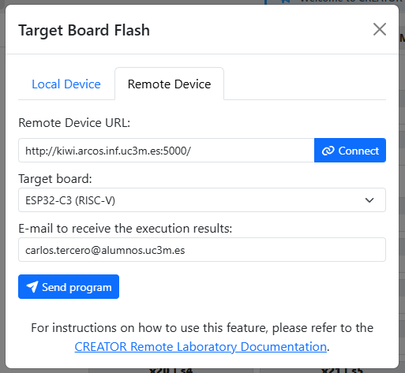
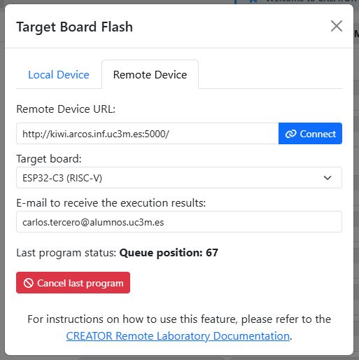

# CREATOR Remote Laboratory

CREATOR's Remote Laboratory allows students to execute their programs in remote ESP32 hardware provided by their teachers.

> [!IMPORTANT]
> Currently, we do not support keyboard (STDIN) inputs.

 <!-- Mini-separator to break up the alerts -->

> [!NOTE]
> If you want to deploy your own remote laboratory, see [Setting up the Remote Laboratory](../teaching-resources/remote-lab.md).

## User Interface

The Remote Device Target Flash menu can be accessed from _Tools_ → _Flash_ → _Remote Device_ in the simulator view.

1. Connect to the Remote Device URL where the server is deployed, e.g. `http://kiwi.arcos.inf.uc3m.es:5000`.
2. Select one of the available board types that the server supports
3. Enter your e-mail address to receive the execution results
4. Execute your program by using the _Send program_ button.

The status of your program will be displayed. You can cancel the execution by using the _Cancel last program_ button.

