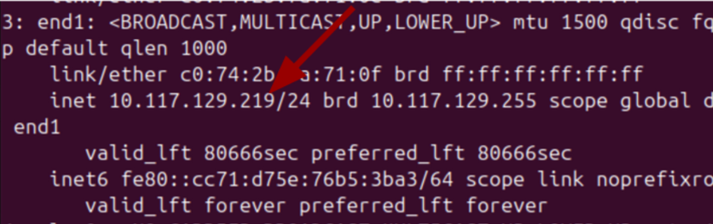
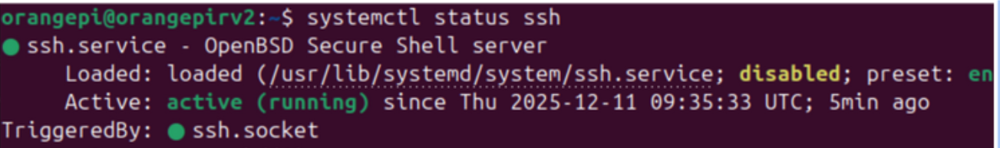

# RISCV-64 SBC's Support

This user tutorial is for RISC-V SBC boards where a Linux distro which can handle SSH and install gdbgui in their systems. At the moment, SBC RISCV board with Ubuntu Support (v.24.04.3) fullfill this requirements.

**SBC boards used:**

* [OrangePi RV2](http://www.orangepi.org/html/hardWare/computerAndMicrocontrollers/service-and-support/Orange-Pi-RV2.html): 8 cores RISC-V. Wifi and Bluetooth conection
* [Nezha D1-H 64 bit RISC-V](https://canonical-ubuntu-hardware-support.readthedocs-hosted.com/boards/how-to/allwinner-nezha-d1/): Unicore RISC-V64. In Ubuntu does not have WiFi conection or UI.

Recomendations for a correct SBC setup:

* Have the recommended power supply for every SBC.
* Use a class10 microSD from a recognisable brand from Amazon or another reliable retailer.
* A good Ethernet Cable.

## SBC enviroment setup

1. Operative System preparation acording to the SBC or Canonical Ubuntu's instructions.
2. Create the **default folder** where your CREATOR proyects will be saved. By default, this directory will be named "creator"
3. Give the **correct rights** to the directory

   ```
   sudo chown user:user ~/creator
   sudo chmod u+rwx ~/creator
   ```
4. **Connect the SBC to the Internet** via Ethernet or Wifi if possible.

   1. Depending on the SBC's configuration, SBC ip will change from time to time.Check the IP every first use.
      `ip a`

      
5. Check **ssh** SBC's status

   ```
   systemctl status ssh
   ```
   
6. Check username

   1. **Default username**: Normally, is the name on the left side of the "@". However, it can be checked out by typing

      ```
      whoami
      ```
   2. **New SBC user.**
7. Check if  **an ssh connection can be stablished** from the computer connected to CREATOR to the SBC

   ```
   ssh <usuario>@<ip>
   ```
   1. Every time an ssh connection is made, the system will ask for a password. It can beoverriden by copying your computer¡s SSH keys to the SBC.

      Create ssh key in your computer

      ```
      ssh-keygen -t rsa -b 4096
      ```
      Copy the ssh code to SBC

      ```
      ssh-copy-id <user>@<ip>
      ```
8. Install [GDBGUI](https://www.gdbgui.com/)

   To prevent incompatibility problems, gdbgui will be installed inside a virtual environment which the driver will access automatically. It has to have the exact same name as the tutorial says.

   - Install **virtual enviroments** and create one

   ```
   sudo apt install python3.12-venv 
   python3 -m venv ~/gdbgui-venv 
   source /home/ubuntu/gdbgui-venv/bin/activate 
   ```
   - Install **GDBGUI** and its dependences

   ```
   sudo apt install build-essential python3-dev python3-pip python3-setuptools python3-wheel gdb 

   pip3 install gdbgui
   ```
   - Small **configuration on gdbgui** (looking forward for a next update to fix this)

   ```
   sed -i "/extra_files=get_extra_files()/a\        allow_unsafe_werkzeug=True," ~/gdbgui-venv/lib/python3.12/site-packages/gdbgui/server/server.py
   ```
   - To check if changes were OK:

   ```
   grep -n "allow_unsafe_werkzeug" ~/gdbgui-venv/lib/python3.12/site-packages/gdbgui/server/server.py
   ```
   ## Usage with CREATOR's Simulator


   1. Install driver's dependencies

      ```
      pip3 install flask flask_cors
      ```
   2. Download SBC's driver from prerequisites page and unzip it

      ```
      unzip driver.zip
      cd sbc
      ```
   3. Execute gateway

      ```
      python3 gateway.py
      ```
