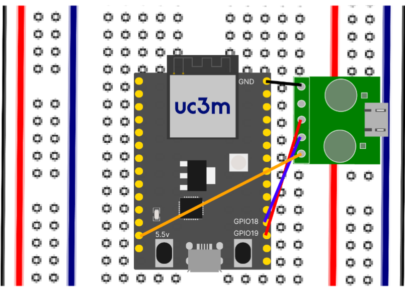
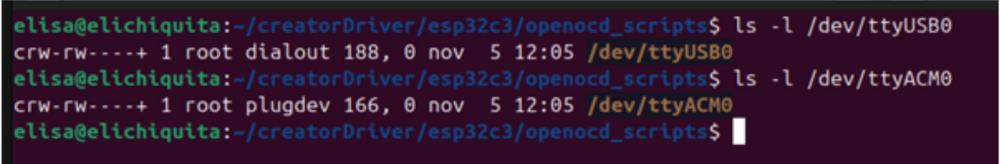
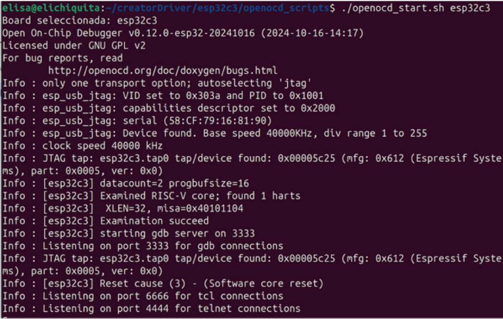
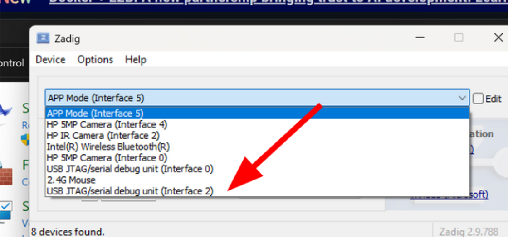
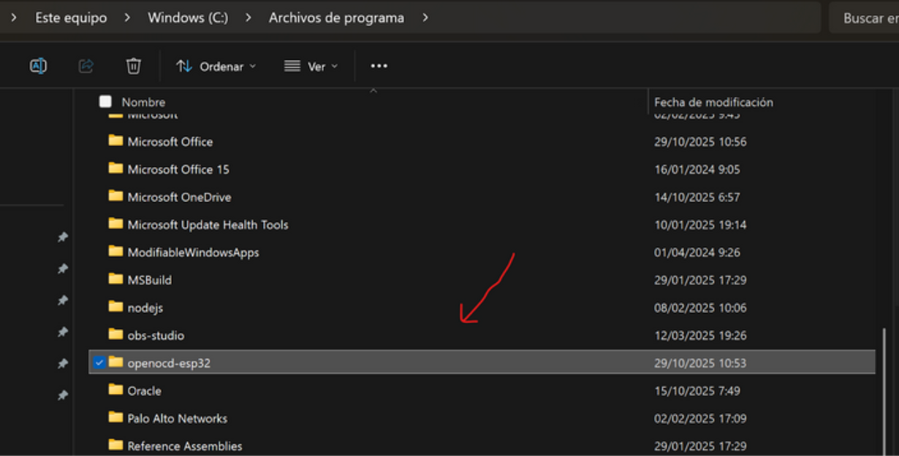
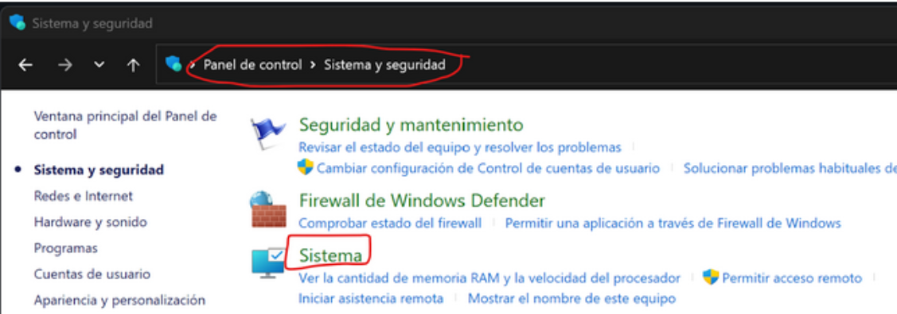
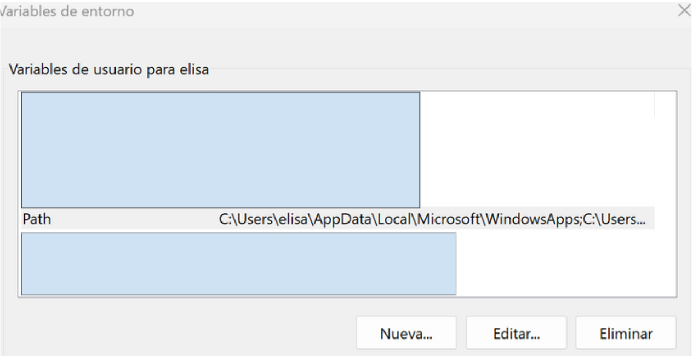
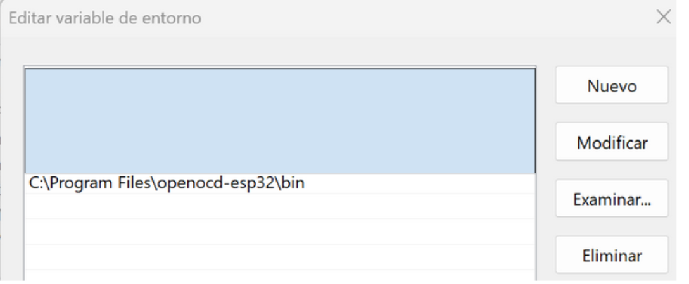
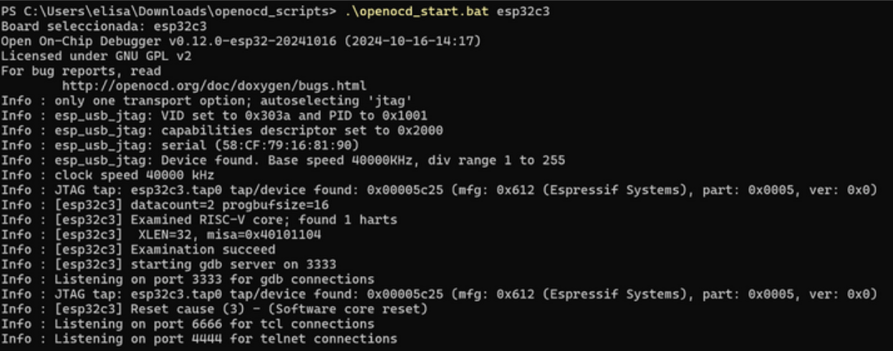

# Target Flash menu.

CREATOR has real-hardware support for multiple RISC-V processors devices:

## Espressif ESP32 RISC-V support:

At the moment, CREATOR support this processors and development boards:

    1.[ESP32-C3](https://www.espressif.com/en/products/socs/esp32-c3):

* [  ESP32-C3-DevKitC-02](https://docs.espressif.com/projects/esp-dev-kits/en/latest/esp32c3/esp32-c3-devkitc-02/index.html) (includes JTAG)
* [  ESP32-C3-DevKitM-1](https://docs.espressif.com/projects/esp-dev-kits/en/latest/esp32c3/esp32-c3-devkitm-1/index.html) (no JTAG detected)

  2.[ ESP32-C6](https://www.espressif.com/en/products/socs/esp32-c6)
* [ESP32-C6-DevKitC-1](https://docs.espressif.com/projects/esp-dev-kits/en/latest/esp32c6/esp32-c6-devkitc-1/index.html) (JTAG + port included)
* [ESP32-C6-DevKitM-1](https://docs.espressif.com/projects/esp-dev-kits/en/latest/esp32c6/esp32-c6-devkitm-1/index.html) (JTAG + port included)

  3.[ESP32-H2](https://www.espressif.com/en/products/socs/esp32-h2)
* [ESP32-H2-DevKitM-1](https://docs.espressif.com/projects/esp-dev-kits/en/latest/esp32h2/esp32-h2-devkitm-1/user_guide.html) (JTAG + port)

### Target Board Espressif Buttons

This is Target Flash menu, with all its buttons explained:


1. **Target Board**: Select between the ESP32 devices available
2. **Target Port:** Checkout how does your device recognises UART device connection
   1. **Linux:** /dev/ttyUSB0
   2. **MacOs:** /dev/cu-usb
   3. **Windows:** COM3, but native windows compatibility is NOT AVAILABLE. Checkout Docker Windows.
3. **Flash URL**: URL direction where the driver will be displaed. By default is localhost:8080 but the user can change if need it.
4. **Buttons**:
   1. **Flash:** Builds and flashes CREATOR's program into your development board.
   2. **Monitor:** Executes development board's flashed program. It can be stopped by using the "Stop" button or the keyboard shortcuts Ctrl + ]  or Ctr+T + X.
   3. **Debug**: If all good connected, it will open anoither tab with GDB UI ready to execute step-to-step programs.
   4. **Clean**: Erases computer's copy of the build program.
   5. **Erase-flash:** Erases program inside the development program.

### Native driver execution prerequisites:

The use of the native version of the driver need to be in a Linux/MacOS environment with the following prerequisites:

1. **ESP-IDF framework**: This driver uses especifically v.5.3.2 version of thew driver, that can be downloaded here: [Driver](https://github.com/espressif/esp-idf/releases/tag/v5.3.2)
2. **Python version from 3.9 to 3.11**: As it's an old version, we recommend creating and using a virtual environment.

* **Install python 3.9:**

```
sudo apt install software-properties-common
sudo add-apt-repository ppa:deadsnakes/ppa
sudo apt install python3.9   
```

- **Create virtual environment:**

  ```
  python3.9 -m venv ~/.espressif/python_env/idf5.3_py3.9_env
  source ~/.espressif/python_env/idf5.3_py3.9_env/bin/activate                      
  ```

* **Check and erase if you have newer python environment versions (by default it will choose the newer one):**

```
rm -rf ~/.espressif/python_env/idf5.3_py3.10_en 
```

3. **Install debug dependences:** Openocd is already installed in  ESP-IDF, but in order to debug it is ncecesary to install gdbgui:

   `pip3 install gdbgui`

   ⚠ ️ When using ESP32-C6 or ESP32-H2 develeopment boards, only another USB-C cable is necesary. However, ESP32-C3 devices need an extra USB-to-Dip device in order to work, as shown in the diagram:

   

   Checkout your **board's debug preferences** here: [https://docs.espressif.com/projects/esp-idf/en/stable/esp32c3/get-started/index.html#what-you-need](https://docs.espressif.com/projects/esp-idf/en/stable/esp32c3/get-started/index.html#what-you-need)
4. **Install driver's dependences:**

   ```
   pip3 install flask flask_cors
   ```
5. Download the **driver linked into the prerequisites** page.
6. Install ESP-IDF dependences and export ESP-IDF symbols using Espressif's scripts:

   Install ESP-IDF dependencies inside the virtual environment:

   ```
   $HOME/esp-idf-v5.3.2/install.sh
   ```

   Load the environment variable for your board with:

`. $HOME/esp-idf-v5.3.2/export.sh`

7. **Excute** the gateway:

   `python3 gateway.py`

#### Native debug:

In order to debug locally in your computer, check out this conditions:

1. Checkout **ports permissions**: In order to flash and debug this development boards, your user must be in plugdev and dialout (in Ubuntu). In ARCH is uucp user.

   

   Using this commands to add your user into the ones given:

   ```
   sudo usermod -a -G dialout $USER
   sudo usermod -a -G plugdev $USER

   ```
2. If this is not enough,create a  new ` /etc/udev/rules.d/99-Espressif.rules` file (with sudo) containing:

```
SUBSYSTEM=="usb", ENV{DEVTYPE}=="usb_device", ATTRS{idVendor}=="303a", ATTRS{idProduct}=="1001", GROUP="plugdev"
SUBSYSTEM=="tty", ATTRS{idVendor}=="10c4", ATTRS{idProduct}=="ea60", GROUP="dialout", MODE="0660"

```

And recharge the rules using:

```
sudo udevadm control --reload-rules
sudo udevadm trigger

```

   To checkout id and vendor, lookup with `lsusb `command:

```
   ...
   Bus 003 Device 022: ID 303a:1001 Espressif USB JTAG/serial debug unit
   ...


```

For more information, checkout the original documentation: [JTAG](https://docs.espressif.com/projects/esp-idf/en/stable/esp32/get-started/establish-serial-connection.html)

## Docker linux prerequisites

To use this is necesary UART and JTAG ports have the correct rules and users assignated.

1. **Install** CREATOR's docker image `creatorsim/creator_gateway`

   ```
   docker pull creatorsim/creator_gateway
   ```
2. **Run the image** with the correct ports opened:

   ```
   docker run --init -it --device=/dev/ttyUSB0  --add-host=host.docker.internal:host-gateway -p 8080:8080 -p 5000:5000 --name creator_gateway creatorsim/creator_gateway /bin/bash
   ```
3. **Run the driver** inside container's shell:

   ```
   ./start_gateway.sh
   ```
4. For using debug inside docker, install openocd inside your Linux/MacOs device for Espressif devices: [LINK](https://github.com/espressif/openocd-esp32/releases/tag/v0.12.0-esp32-20241016)
5. Unzip the Openocd distro and **copy the binary** on the PATH

   ```
   sudo cp -r bin/ /usr/local/bin/openocd-esp32
   sudo ln -s /usr/local/bin/openocd-esp32/openocd /usr/local/bin/openocd
   ```
6. **Export routes** (can be also added into .bashrc script)

   ```
   export PATH="<openocd_route>/openocd-esp32/bin:$PATH"
   export OPENOCD_SCRIPTS="<openocd_route>/openocd-esp32/share/openocd/scripts"

   ```
7. Open openocd_start.sh script that can be downloaded in "Debug" site with the board wanted

   `./openocd_start.sh esp32c3`

   
8. Press "Debug" button and start debugging.

   ### Docker Windows prerequisites


   1. Install [Docker Desktop](https://docs.docker.com/desktop/setup/install/windows-install/).
   2. Download[ esptool](https://github.com/espressif/esptool/releases)
   3. Pull `creator_gateway` image in Docker Desktop:
      1. Search for `creatorsim/creator_gateway` in the Docker Desktop browser
      2. Click the "Pull" button
   4. For debug purposes, install JTAG device on to your Windows device.
      1. Install **Zadig**: [LINK](https://zadig.akeo.ie/ç)
      2. List all the devices in Options > List All Devices and search for **“USB Jtag/serial debug unit (Interface 2)"**

         
      3. Downgrade the driver

         
   5. For debug purposes, **install OpenOCD** in your Windows device: [LINK](https://github.com/espressif/openocd-esp32/releases/tag/v0.12.0-esp32-20241016)
      1. Unzip and move its content to "Program Files"

         
      2. Contol pannel > System and Security > System

         
      3. Go to Information > Advanced system settings

         
      4. Inside the System Properties window, go to the Advanced tab > Environment Variables > User variables > PATH

         
      5. Add openOCD path as a enviroment variable pressing NEW
      6. 
   6. **Run the image**:
   7. 1. Click the "Run" button
      2. Click the **"Optional settings"** button
      3. **Open** this ports:

         1. 8080 (CREATOR's conection)
         2. 5000 (GDBGUI interface)
         3. 3333 (Openocd interface)
         4. 4444 (telnet openocd conection)
            Using **Windows Powershell:**

            ```
            docker run -it --rm `
            >>   --name creator_gateway `
            >>   -p 3333:3333 `
            >>   -p 8080:8080 `
            >>   -p 5000:5000 `
            >>   creatorsim/creator_gateway:latest

            ```

            Connect the computer with esp_rfc2217_server

            ```
            esp_rfc2217_server -v -p 4000 <target_port>
            ```

            * For more information: [https://docs.espressif.com/projects/esptool/en/latest/esp32/remote-serial-ports.html](https://docs.espressif.com/projects/esptool/en/latest/esp32/remote-serial-ports.html)
         5. For debugging purposes, start `openocd_start.bat` script (downloadable in "Debug" site)with the desired development board.

            `.\openocd_start.bat esp32c3`

            
      4.
