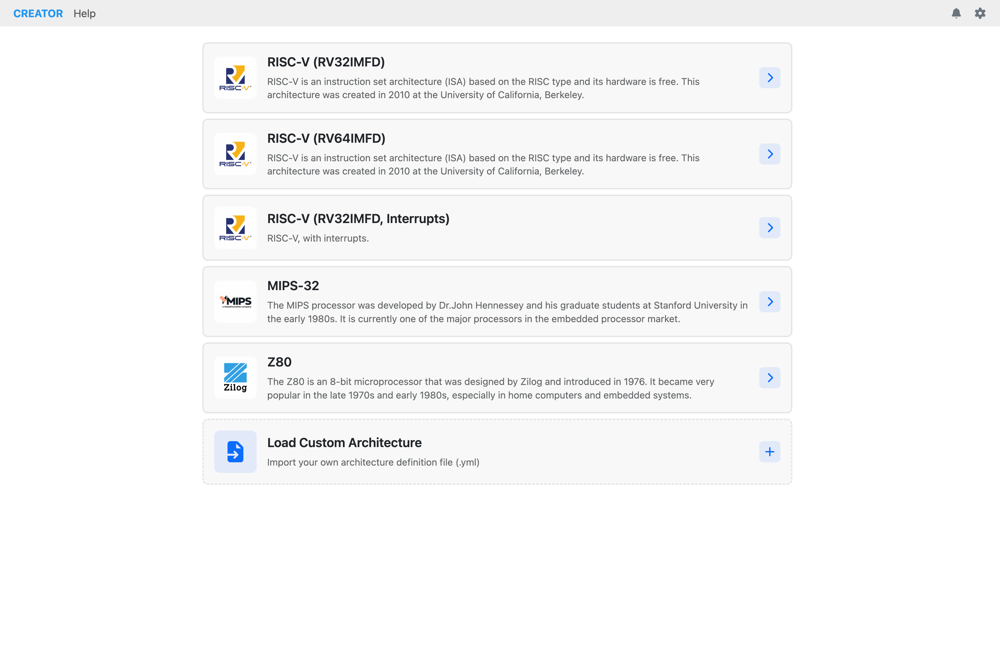
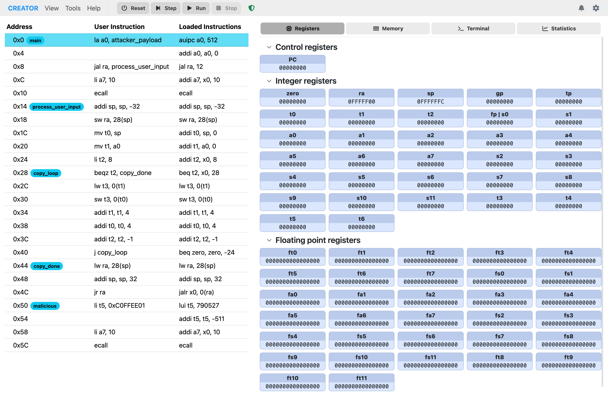
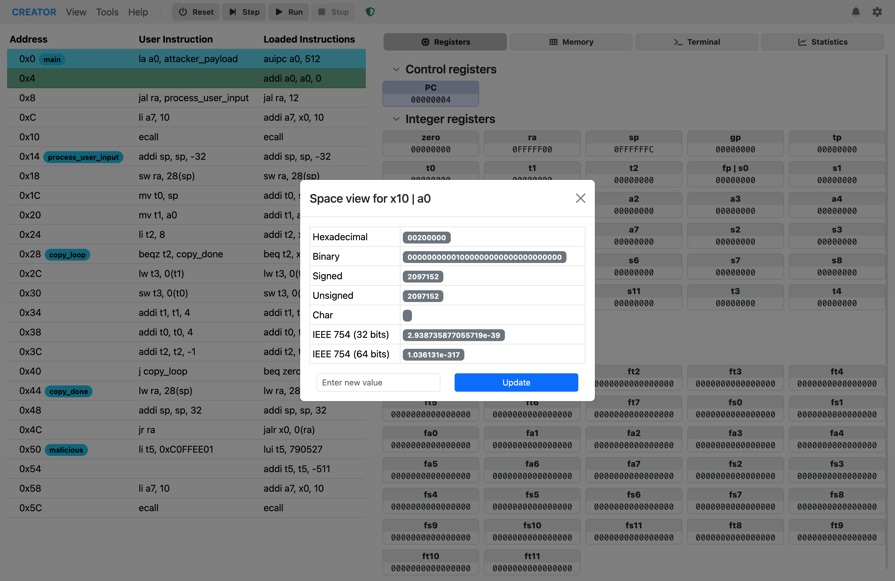
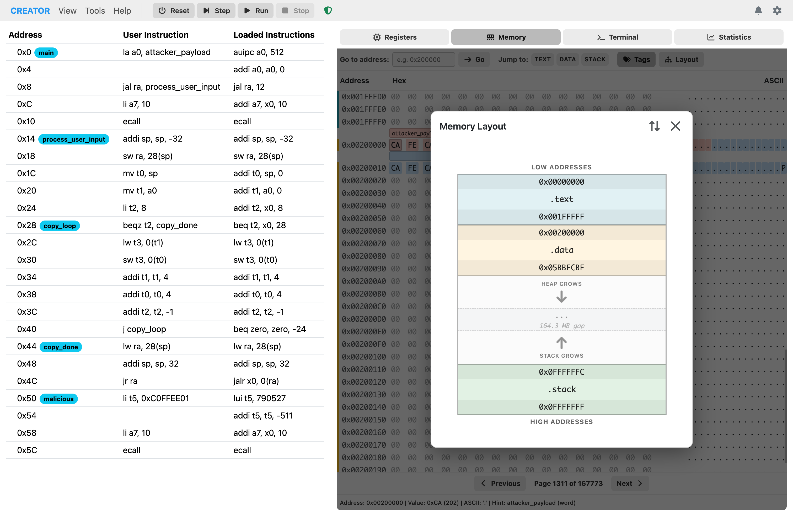
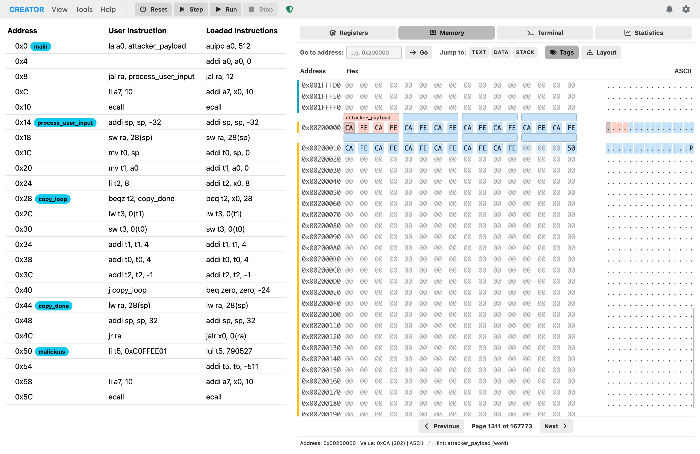
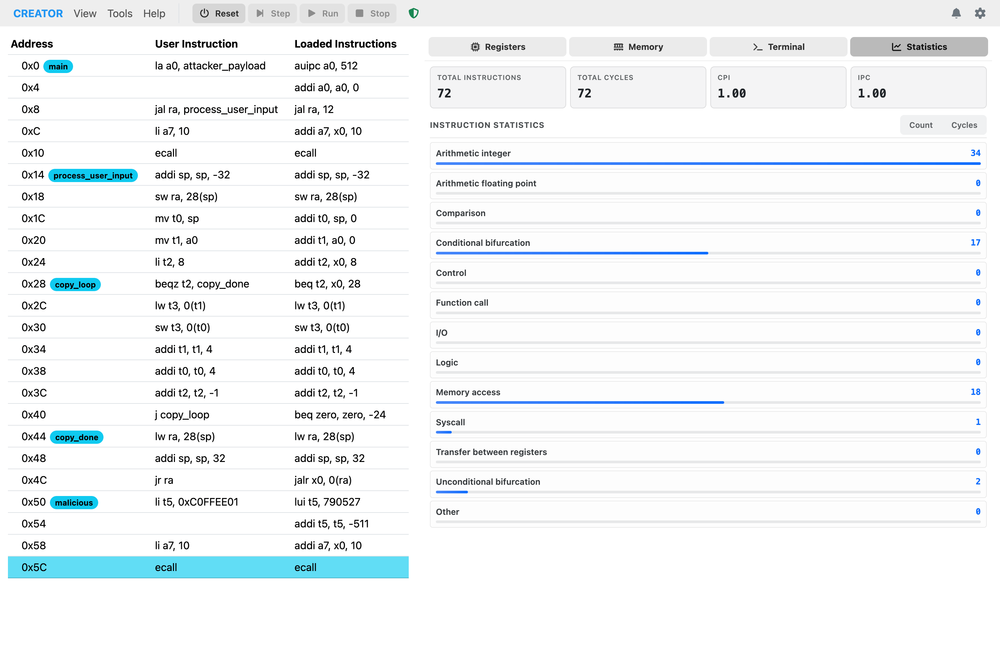
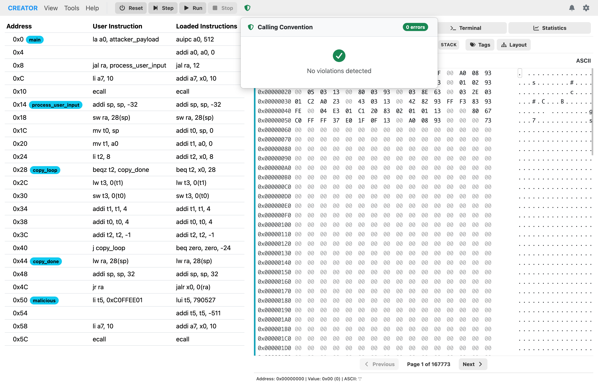
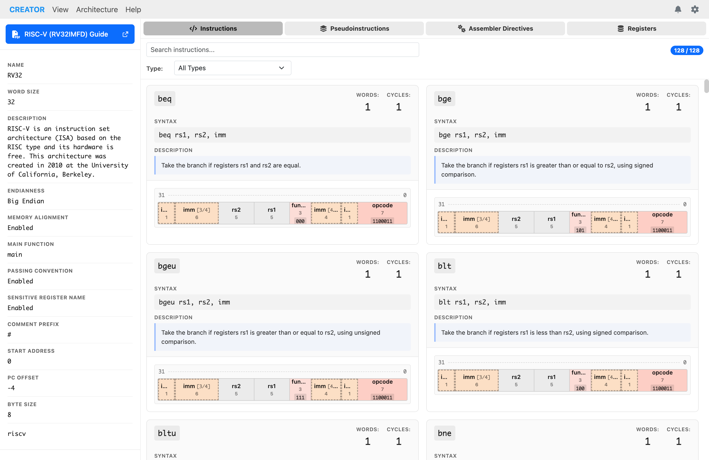
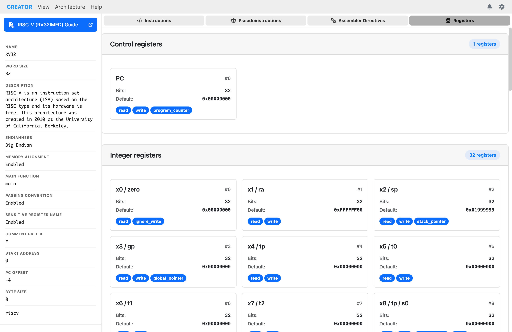

# User Interface

The CREATOR web interface is designed for efficiency and ease of use. This guide covers all UI components and their functions.

CREATOR uses a familiar global menu bar at the top of the window for accessing various features and settings, which change based on the current view.
There are four main views: Architecture Select, Editor, Simulator, and Architecture. To change between the views, use the "View" menu in the top-left corner.

## Architecture Select View
The Architecture Select view is the initial screen you see when you open CREATOR. It allows you to choose the processor architecture you want to work with. You can select from a list of predefined architectures or load a custom architecture YAML file.

*Figure: Architecture selection view for choosing processor architecture.*

## Editor View

CREATOR features a powerful code editor based on the Monaco Editor (the same editor used in VS Code). The editor supports syntax highlighting, IntelliSense, line numbers, breakpoints, and more. For specific editor features, refer to the [Editor Features](editor-features.md) chapter.

*Figure: Default view of the code editor with syntax highlighting.*

### Editor Menu Actions

When in the editor view, the menu bar provides the following exclusive actions:
#### File
- **New File...**: Clear editor and start fresh
- **Open File...**: Load file from disk
- **Save As**: Download current code
- **Examples...**: Load example code
- **Get Code as URI**: Generate shareable URL

#### Library
- **Load Library...**: Load assembly libraries
- **Remove Library...**: Remove the loaded library
- **Library Tags**: View tags from the loaded library

## Simulator View

The simulator view is divided into two columns: the left column contains the loaded instructions, while the right column contains tabs for execution control, registers, memory, and statistics.

*Figure: Default simulator panel showing execution controls and tabs.*

### Left Column: Instruction List
The left column displays the list of loaded instructions in a scrollable panel. Each instruction is shown with its address, user representation (which may include pseudo-instructions), and the underlying assembled instruction.

### Right Column: Simulator Tabs
#### 1. Registers Tab

The Registers tab displays the register bank(s) for the loaded architecture. You can view values in hexadecimal (the default), decimal (signed or unsigned) Clicking on a register opens a modal that shows even more display options, including binary, char, and IEEE 754 formats. This modal also allows you to edit the register value directly.

*Figure: Registers tab displaying register values in space view mode.*

#### 2. Memory Tab

The Memory tab provides a full-featured hex editor. You can navigate to specific addresses, jump to memory sections (data, code, stack, heap), and toggle the tag display for easier debugging. The tag display shows the name of the variable or section associated with each memory address, if available. Hints are also shown for memory locations that have been tagged with type information. These addresses are highlighted in a different color for easy identification.

*Figure: Memory tab showing hexadecimal memory contents.*

The hex editor also provides a memory layout diagram to help visualize different memory regions and their purposes.

*Figure: Memory layout diagram showing different memory regions.*

To jump to a specific address, use the "Go to Address" input field. You can also quickly navigate to predefined sections like data, code, stack, and heap using the corresponding buttons.

*Figure: Memory viewer focused on data section.*

You can also edit the memory contents directly by clicking on a byte and typing a new value. The editing mode allows you to modify memory on-the-fly during program execution or while paused at a breakpoint. You can edit multiple bytes in a row, simply by typing the new values consecutively.

#### 3. Terminal Tab
The terminal tab provides an interface for program input and output, simulating a console environment.

*Figure: Terminal tab showing a simple sum program interaction.*

#### 4. Statistics Tab

The Statistics tab shows execution metrics including the number of instructions executed, clock cycles, CPI (Cycles Per Instruction), and simulated execution time.

*Figure: Statistics tab displaying execution metrics and performance data.*

### Sentinel
CREATOR includes a Sentinel feature that monitors the execution status of your program. It provides feedback on whether the parameter passing conventions are being folowed correctly. The sentinel button changes color based on the status:
- **Green (OK)**: All parameters passed correctly
- **Red (Error)**: Parameter passing conventions violated

*Figure: Simulator panel with sentinel status OK, indicating successful execution.*

*Figure: Simulator panel with sentinel status Error, indicating a parameter passing violation.*

## Architecture View

The architecture panel provides detailed information about the currently loaded architecture, including registers, instructions, directives, and pseudo-instructions. The left sidebar contains general architecture information such as the name, word size, endianness, and other relevant details.

### Architecture Instructions
The instructions section lists all supported assembly instructions for the selected architecture, along with their syntax, help, and encoding details.
The diagrams are dynamically generated based on the architecture YAML definition.

*Figure: List of supported assembly instructions.*

### Architecture Pseudo-Instructions
The pseudo-instructions section displays all pseudo-instructions available for the architecture. Pseudo-instructions are higher-level assembly commands that expand into one or more real instructions during assembly.

*Figure: Pseudo-instructions that expand to multiple real instructions.*

### Architecture Directives
The directives section shows all assembler directives supported by the architecture, along with their syntax and descriptions.

*Figure: Assembler directives available for the architecture.*

### Architecture Registers
The registers section provides a comprehensive list of all registers defined in the architecture, including their names, descriptions, and types.

*Figure: Architecture panel showing available registers for the selected processor.*

## Settings Menu
The setting menu is always accessible from the top-right corner of the interface. It provides options to customize the appearance and behavior of the editor and simulator.

The settings menu allows you to switch from light and dark mode. You can also adjust editor preferences and customize keyboard shortcuts.

*Figure: Settings menu dropdown showing theme selection and other options.*
