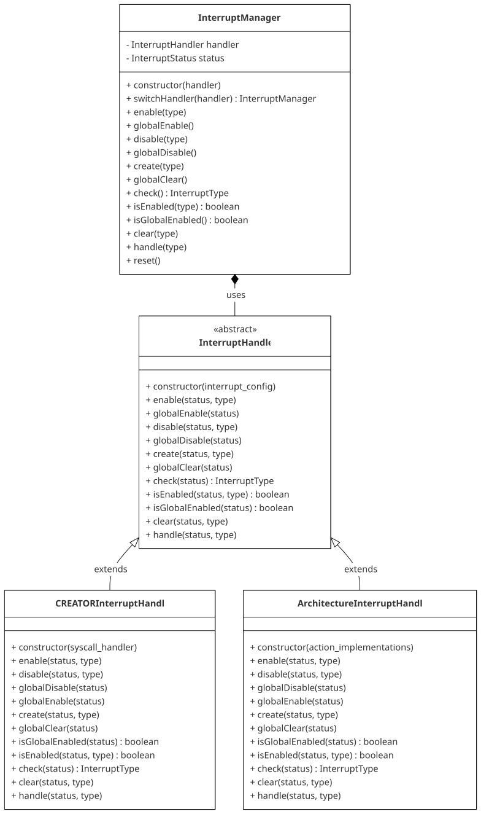

# Interrupts

CREATOR supports a fully configurable interrupt system for simulating asynchronous events and exception handling, with multiple interrupt types. However, to prevent the user having to understand and implement this system to be able to use system calls (which require using interrupts), the interrupt manager allows switching between two interrupt handlers: the default "CREATOR" handler - which only handles system calls - and a custom architecture handler.

When the default handler is active, each generated interrupt will execute the architecture-defined `creator_syscall`, which is in charge of performing the desired actions (writing to console, etc.). In the `custom` handler, the ISA-specific interrupt handling routine is defined.
The architecture also defines how to create and check for each type of interrupt, enabling and disabling (globally and by type), clearing, and checking for enable.

The interrupt system uses all of these definitions to ensure a "realistic" representation of how interrupts work in the ISA (updating registers, etc.), regardless of the handler.

!!! note
    More information about how to configure the architecture in [Creating Custom Architectures](../teaching-resources/custom-architectures.md#interrupt-support).

The following is an overview of the interrupt architecture:

{ loading=lazy }
/// caption
Interrupt architecture overview.
///

CREATOR comes with a predefined set of interrupt types for the user to utilize. Not all of them need to be used.

- `InterruptType.Software`
- `InterruptType.Timer`
- `InterruptType.External`
- `InterruptType.EnvironmentCall`
- `InterruptType.Maskable`
- `InterruptType.NonMaskable`

The interrupt manager is stored in the core (`interruptManager`), and the interrupt handler in the status (`status.interrupt_handler`). When switching handlers, the state is preserved (pending interrupts, enabled status, etc.).

!!! info
    More details in the Master Thesis ["Implementing Interrupts, Timers, and Memory-Mapped I/O in CREATOR"](../assets/interrupts-thesis.pdf), by Luis Daniel Casais Mezquida.
