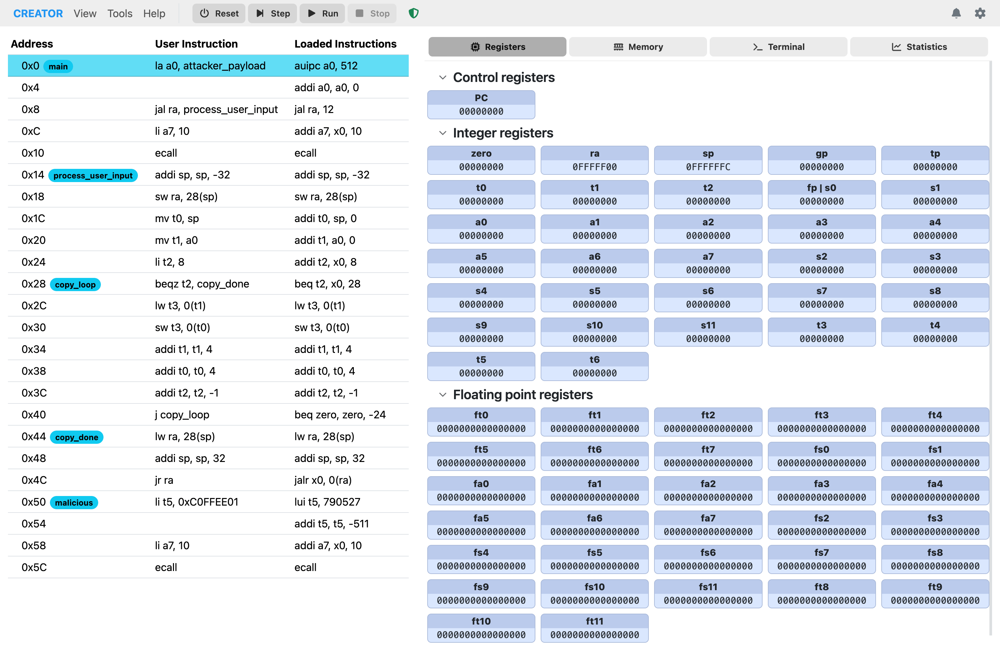

# Web Use Guide

CREATOR is a browser-based assembly programming environment that requires no installation. It provides a complete development and debugging environment for multiple architectures directly in your web browser.

Visit [creatorsim.github.io/creator](https://creatorsim.github.io/creator) to use CREATOR online.

{ loading=lazy }
/// caption
CREATOR main interface
///

## Features

- **Multi-Architecture Support**: Work with RISC-V, MIPS, Z80, and custom architectures.
- **Integrated Code Editor**: Syntax highlighting, IntelliSense, and code navigation.
- **Simulator**: Step through code, set breakpoints, and inspect memory/registers.
- **Modular Assemblers**: Support for multiple assemblers like CREATOR Assembler and RASM.
- **User-Friendly Interface**: Intuitive layout with architecture selection, code editor, and simulator panels.
